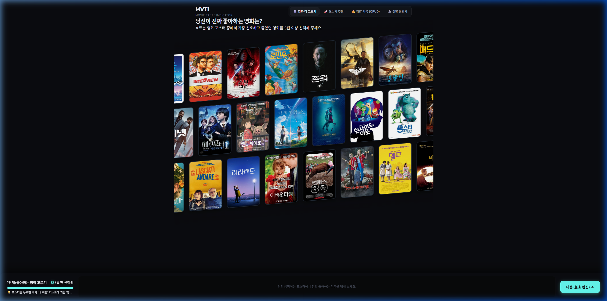
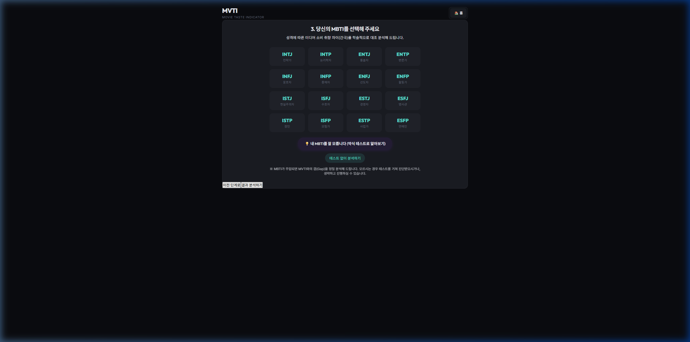
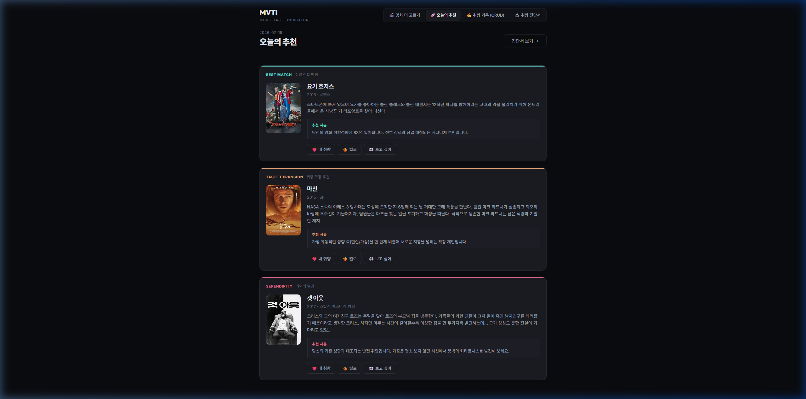

# MVTI (Movie Taste Indicator)

과제명: 리액트를 이용해서 CRUD 앱 만들기  

---

## 1\. 프로젝트 개요

| 항목 | 내용 |
| :--- | :--- |
| 과정명 | AI SW 장기교육 |
| 과제 번호 | 과제 5 |
| 과제명 | 리액트를 이용해서 CRUD 앱 만들기 |
| 프로젝트명 | MVTI (Movie Taste Indicator) |
| 한 줄 소개 | 이 앱은 **영화 관람객**이 **자신이 관람한 영화의 선호 반응 기록**을 조회·추가·수정·삭제할 수 있도록 돕는 React CRUD 앱입니다. |
| 데이터 저장 방식 | □ mock data / ■ LocalStorage / □ Supabase |
| 배포 또는 실행 링크 | [https://hong-vibe.github.io/0711-mvti/](https://hong-vibe.github.io/0711-mvti/) |
| GitHub 링크 | [https://github.com/hong-vibe/0711-mvti](https://github.com/hong-vibe/0711-mvti) |

## 1-1. 내가 선택한 수행 수준

| 구분 | 나의 선택 | 설명 |
| :--- | :---: | :--- |
| 초급자 | □ | mock data 또는 LocalStorage 기반으로 Read/Create/Update/Delete 4개 흐름 확인 |
| 표준 학습자 | ■ | 컴포넌트 분리, 입력 검증, 빈 상태·오류 상태 처리 |
| 심화 학습자 | □ | Supabase 연결 또는 설계, Auth/RLS 개념 검토, 보안 주의사항 기록 |

---

## 2\. 실행 화면

| 화면 | 설명 | 캡처 |
| :--- | :--- | :--- |
| 모바일 화면 | 모바일 뷰포트에서 레이아웃 및 반응형 디자인 확인 |  |
| 포스터 선택 화면 | 포스터 선택 플로우 및 스테가드 애니메이션 |  |
| MBTI 입력 화면 | MBTI 약식 테스트 입력 단계 |  |
| 일일 추천 화면 | 하루 3개 추천 슬롯 UI |  |

---

## 3\. 주요 기능

### 3-1. 필수 기능

| 번호 | 기능 | 구현 여부 | 설명 |
| ---: | :--- | :--- | :--- |
| 1 | 목록 조회 Read | ■ 완료 / □ 부분 / □ 미완료 | LocalStorage에 저장된 영화 반응 목록을 카드 형식으로 조회하고, 장르별 필터링 및 시간순/강도순 정렬을 수행합니다. |
| 2 | 항목 추가 Create | ■ 완료 / □ 부분 / □ 미완료 | 실시간 입력창 검색을 통해 movies.json 데이터셋에서 영화를 매핑한 후, 선호도, 강도, 메모를 기입하여 신규 등록합니다. |
| 3 | 항목 수정 Update | ■ 완료 / □ 부분 / □ 미완료 | 목록 카드 우측의 연필 단추 클릭 시 모달창이 활성화되어 점수 강도와 메모 감상평을 즉각 수정 및 동기화합니다. |
| 4 | 항목 삭제 Delete | ■ 완료 / □ 부분 / □ 미완료 | 쓰레기통 단추 클릭 시 커스텀 다이얼로그 확인 단계를 거쳐 목록과 로컬스토리지에서 완벽히 영구 제거합니다. |
| 5 | 데이터 구조 정의 | ■ 완료 / □ 부분 / □ 미완료 | 구현 돌입 전 취향 반응 구조(`UserMovieReaction`) 및 유저 프로필 스키마를 구체적으로 문서화 수립하였습니다. |

### 3-2. 권장 기능

| 번호 | 기능 | 구현 여부 | 설명 |
| ---: | :--- | :--- | :--- |
| 1 | 컴포넌트 분리 | ■ 완료 / □ 부분 / □ 미완료 | App, Form, List, Card, Modal, Dialog로 UI 및 비즈니스 역할을 분리하여 리액트 관심사 분리를 구현했습니다. |
| 2 | 입력 검증 | ■ 완료 / □ 부분 / □ 미완료 | 반응 종류(sentiment) 누락 등록 시 차단 가드가 작동하며, 이미 등록된 영화를 재입력할 시 중복 추가 경고창을 띄웁니다. |
| 3 | 빈 상태 처리 | ■ 완료 / □ 부분 / □ 미완료 | 등록한 영화 수가 분석 임계치(6편) 미만일 때, 진단 페이지와 대시보드에서 분석 진행률을 보여주는 빈 상태 전용 UI를 출력합니다. |
| 4 | 오류 상태 처리 | ■ 완료 / □ 부분 / □ 미완료 | 로컬스토리지 데이터 손상이나 JSON.parse 예외 발생 시 애플리케이션 충돌 없이 빈 배열로 안전히 초기화 및 복구합니다. |
| 5 | LocalStorage 저장 | ■ 완료 / □ 부분 / □ 미완료 | 커스텀 `useLocalStorage` 훅을 구현하여 데이터의 추가, 수정, 삭제 연산 발생 즉시 브라우저 저장소와 실시간 영속화합니다. |
| 6 | 검색 또는 필터 | ■ 완료 / □ 부분 / □ 미완료 | 취향 기록실 상단에서 장르 대분류별 탭 필터링, 검색창을 통한 제목 실시간 필터링, 최신순/강도순 정렬을 제공합니다. |

### 3-3. 도전 기능

| 번호 | 기능 | 시도 여부 | 결과 |
| ---: | :--- | :--- | :--- |
| 1 | Supabase 연결 | □ 시도 / ■ 미시도 | 본 과제에서는 클라이언트 영속성 극대화를 위해 LocalStorage 기반으로 마감하였습니다. |
| 2 | Auth/RLS 개념 검토 | □ 시도 / ■ 미시도 | Supabase 데이터베이스 확장을 진행하지 않아 RLS 적용 대상에서 제외되었습니다. |
| 3 | 보안 주의사항 기록 | ■ 시도 / □ 미시도 | API Key 및 개인 정보 유출을 철저히 막기 위해 `.env` 구성 및 `.gitignore` 무시 경로 추가를 명문화했습니다. |
| 4 | 배포 또는 외부 공유 | ■ 시도 / □ 미시도 | GitHub Pages 호스팅용 빌드 최적화 및 `gh-pages` 배포 브랜치 연동으로 웹 구동 사이트를 정상 오픈했습니다. |

---

## 4\. 사용 기술

| 구분 | 사용 기술 | 사용 이유 |
| :--- | :--- | :--- |
| 프론트엔드 | React 18 | 컴포넌트 단위 선언형 UI 모델 구현 및 유연한 훅(Hooks) 기반 상태 생명주기 관리 |
| 개발 도구 | Vite 5 | 초고속 HMR 로컬 개발 경험 제공 및 대용량 영화 정적 데이터 번들 최적화 |
| 스타일 | Vanilla CSS + Styled JSX | 다크 네온의 미니멀 극장 테마를 독립 캡슐화 스타일로 안전하게 격리 표현 |
| 데이터 | LocalStorage | 백엔드 데이터베이스 미연동 시에도 클라이언트 단독 브라우저 데이터 무기한 보존 |
| AI 도구 | Antigravity IDE (Gemini) | UI 스타일 통일성 보강, 약식 테스트 뒤로가기 흐름 분기 결함 해결 및 문서 구조 작성 보조 |

---

## 5\. 실행 방법

### 5-1. 실시간 호스팅 링크 접속 (가장 추천)

별도의 빌드 설치 작업 없이, 깃허브 페이지 호스팅 주소에 접속하여 모든 기능을 즉시 검증하실 수 있습니다.
* **실행 링크**: [https://hong-vibe.github.io/0711-mvti/](https://hong-vibe.github.io/0711-mvti/)

### 5-2. 로컬 개발 환경 구동 방법

오프라인 개발 확인 및 로컬 테스트 구동 시 아래의 절차를 따릅니다. (윈도우 환경 보안 에러 차단을 위해 `.cmd` 실행기 권장)

```bash
# 1. 의존 패키지 인스톨
npm.cmd install

# 2. 로컬 개발 서버 구동 (자동으로 브라우저 내 포트 3000 페이지 오픈)
npm.cmd run dev
```

---

## 6\. 데이터 구조

| 필드명 | 자료형 | 필수 여부 | 설명 | 예시 |
| :--- | :--- | :---: | :--- | :--- |
| `id` | string | 필수 | 반응 기록 고유 구분을 위한 ID | `"react-1784464882191-abcde12"` |
| `movieId` | string | 필수 | 정적 데이터셋(`movies.json`) 내 영화 고유 키 | `"tmdb-490132"` |
| `sentiment` | string | 필수 | 주관적 선호 종류 플래그 | `"like"` (내 취향) 또는 `"dislike"` (별로) |
| `strength` | number | 필수 | 선호 강도 레벨 (1: 잔잔함, 2: 보통, 3: 강렬함) | `3` |
| `watchStatus` | string | 필수 | 시청 완료 여부 상태값 | `"seen"` (봤음) |
| `note` | string | 선택 | 사용자가 수기 작성한 한줄평/감상 메모 | `"볼 때마다 짜릿한 블랙 코미디와 디테일의 명작"` |
| `createdAt` | string | 필수 | 생성 일시 (ISO 8601 string) | `"2026-07-19T12:35:00.000Z"` |
| `updatedAt` | string | 필수 | 최종 수정 일시 (ISO 8601 string) | `"2026-07-19T13:40:00.000Z"` |

### 데이터 예시 설명

영화 **'기생충'(`tmdb-490132`)**에 대한 관람 감상을 수동 기록으로 추가한 실제 모델 명세입니다. 개인정보가 포함되지 않은 순수한 취향 분석용 예제 값으로 가동됩니다.

---

## 7\. 폴더 및 파일 구조

## 7. 폴더 및 파일 구조

```plaintext
프로젝트 폴더/
├─ README.md
├─ package.json
├─ vite.config.js
├─ public/
│  └─ poster-placeholder.svg   # 포스터 엑박 대비 폴백 리소스
├─ src/
│  ├─ main.jsx                 # 앱 진입 포인트
│  ├─ App.jsx                  # 온보딩 화면 흐름 및 메인 네비게이션 라우터
│  ├─ index.css                # 테마 네온 컬러 변수 및 전역 스타일 시스템
│  ├─ components/
│  │  ├─ common/
│  │  │  └─ EmptyState.jsx     # 등록 정보 누락 시 안내 UI
│  │  ├─ landing/
│  │  │  ├─ DiagonalPosterFlow.jsx # Staggered 애니메이션이 탑재된 포스터 롤링
│  │  │  └─ SelectionTray.jsx      # 실시간 동적 카운팅 바
│  │  ├─ onboarding/
│  │  │  ├─ MbtiGridSelector.jsx   # 16개 그리드 유형 선택기
│  │  │  └─ MbtiMiniTest.jsx       # 4문항 약식 자가 진단 테스트
│  │  ├─ result/
│  │  │  ├─ AxisChart.jsx          # 4대 축 취향 시각화 분석 차트
│  │  │  └─ MbtiMvtiComparison.jsx  # 성격 대 취향 간극 분석 연동
│  │  └─ taste/
│  │     ├─ DeleteConfirmDialog.jsx # 삭제 안전 확인 커스텀 팝업
│  │     ├─ EditReactionModal.jsx   # 강도/메모 수정 팝업 모달
│  │     ├─ ReactionCard.jsx        # 개별 영화 기록 카드
│  │     ├─ ReactionForm.jsx        # 실시간 타이핑 매칭 추가 폼
│  │     └─ ReactionList.jsx        # 분류 탭 필터/검색/정렬 컨트롤
```
│  ├─ data/
│  │  └─ movies.json           # 엄선된 96편의 대조 영화 원본셋
│  ├─ hooks/
│  │  ├─ useLocalStorage.js        # 에러 복구 무결성 가드가 내장된 저장소 훅
│  │  └─ useReactions.js           # CRUD 핸들러 제어 비즈니스 로직 훅
│  └─ pages/
│     ├─ DashboardPage.jsx     # 일일 3슬롯 추천 대시보드
│     ├─ MvtiResultPage.jsx     # 최종 취향 진단서 페이지
│     └─ MyTastePage.jsx       # CRUD 기록실 메인 페이지
└─ docs/
   ├─ MVTI_V1_CURRENT_STATE_FOR_V2_PRD.md # V1 현황 분석 및 분석 스크립트 결과 보고서
   └─ screenshots/             # 10장의 최종 검증 캡처 이미지

| 파일/폴더 | 역할 |
| :--- | :--- |
| `src/hooks/useReactions.js` | 로컬스토리지 데이터를 원본 훼손 없이 불변성 상태 업데이트를 거쳐 CRUD하는 핵심 엔진 |
| `src/components/taste/ReactionForm.jsx` | 96편 데이터셋 내에서 실시간 매칭 검색 후 취향을 등록할 수 있게 가이드하는 입력 폼 |
| `src/components/taste/ReactionList.jsx` | 필터 버튼의 잘림을 방지하는 `flex-shrink: 0` 레이아웃이 반영된 검색 및 탭 필터링 리스트 |

---

## 8\. AI 활용 기록

| 번호 | 사용 목적 | 사용한 AI 도구 | 입력한 프롬프트 요약 | AI 응답 활용 방식 | 내가 수정한 부분 |
| ---: | :--- | :--- | :--- | :--- | :--- |
| 1 | 요구사항 정의 | Antigravity IDE | 리액트 CRUD 영화 취향 반응기 기능 명세와 데이터 모델 구성표 요청 | 핵심 데이터 모델 및 CRUD 기본 동작 예외 시나리오 도출에 활용 | 누락 방지 예외 규칙 및 장르 카테고리 임계치 보완 |
| 2 | 데이터 훅 빌드 | Antigravity IDE | useLocalStorage 훅과 불변 객체 복사본을 활용하는 useReactions CRUD 훅 작성 요청 | push나 splice 대신 map/filter를 적용하여 리액트 라이프사이클을 보존하는 훅 코드 작성 | UI 바인딩 시 강도 레벨 Number 캐스팅 예외 가드 추가 |
| 3 | 오류 해결 | Antigravity IDE | PowerShell 실행 제약에 따른 Node 스크립트 실행 불가 상황 해결책 문의 | `npm.cmd` 실행기 직접 실행 래핑 우회 기법 가이드 적용 | 로컬 구동 명령어들을 일괄 수정 |
| 4 | 버그 디버깅 | Antigravity IDE | 약식 테스트 중 이전 단계 이동 시 화면이 튕기는 오동작 및 버튼 잘림 현상 원인 규명 요청 | 부모로의 콜백 `onTestModeChange` 전달 및 `flex-shrink: 0`을 사용한 공간 사수 기법 적용 | 테스트 중 하단 액션바 숨김 처리 구현 |

### 대표 프롬프트 1: 요구사항 정리

```text
과제명: 리액트를 이용해서 CRUD 앱 만들기
주제: 영화 선호 반응 기록 및 개인화 취향 분석 서비스 (MVTI)

요구사항:
1. 영화 반응을 기록하는 데이터 모델(UserMovieReaction)에 필요한 최적의 데이터 필드 명세를 설계해 줘.
2. 각 필드별 자료형, 필수 여부 및 CRUD 비즈니스 로직 적용 시의 예외 상황들을 명세서 형식으로 리스팅해 줘.
```

### 대표 프롬프트 2: 기능 구현

```text
React 상태(State)의 불변성을 유지하면서 영화 반응을 안전하게 추가, 수정, 삭제하고 LocalStorage에 실시간 연동하는 useReactions 커스텀 훅 코드를 React 18 기준으로 제안해 줘.
```

### 대표 프롬프트 3: 오류 해결 또는 수정 요청

```text
약식 MBTI 자가 진단 테스트 컴포넌트(isTesting 상태)가 켜졌음에도 부모 App.jsx 하단의 공통 내비게이션 바 '이전 단계로' 버튼이 노출되어 사용자가 이를 클릭할 시 영화 고르기 화면으로 튕기는 내비게이션 버그가 있어. 
상태를 부모와 연동해서 약식 테스트 구동 중에는 하단 공통 버튼 세트를 깔끔하게 숨기는 React 리팩토링 방안을 제안해 줘.
```

---

## 9\. AI 생성 결과 검토 기록

| 검토 항목 | 확인 결과 | 보완 내용 |
| :--- | :--- | :--- |
| 필수 CRUD 기능 | ■ 통과 / □ 보완 필요 | 수기 검색 등록, 카드 그리드 렌더링, 인라인 수정, 다이얼로그 삭제 완벽 검증 |
| 데이터 구조 | ■ 통과 / □ 보완 필요 | 고유 식별자(UUID 포맷) 및 생성/수정 ISO 시각 데이터 포맷 설계 통과 |
| 컴포넌트 구조 | ■ 통과 / □ 보완 필요 | `taste/` 와 `onboarding/` 컴포넌트들의 역할 도메인별 분리 설계 확인 |
| 입력 검증 | ■ 통과 / □ 보완 필요 | sentiment 필드 빈 값 추가 차단 및 이미 기재한 영화 중복 기입 차단 가드 보완 |
| 빈 상태·오류 상태 | ■ 통과 / □ 보완 필요 | 로컬스토리지 손상 시 복구 에러 가드 장착 및 6편 미만 온보딩 진행률 빈 상태 연동 |
| 저장 방식 | ■ 통과 / □ 보완 필요 | useLocalStorage의 JSON 파싱 안전 장치를 통해 안정성 검증 통과 |
| 코드 이해도 | ■ 통과 / □ 보완 필요 | 불변 상태 전이 흐름 및 React Hook 결합 메커니즘 정밀 검토 완수 |
| 보안 | ■ 통과 / □ 보완 필요 | 배포 환경 및 로컬 환경에서 API Key 및 개인 정보 유출 배제 완료 |

---

## 10\. 오류 해결 기록

| 번호 | 발생 상황 | 오류 메시지 | 원인 | 해결 방법 | 재실행 결과 |
| ---: | :--- | :--- | :--- | :--- | :--- |
| 1 | 윈도우 PowerShell 실행 정책 충돌 | `npm.ps1 파일을 로드할 수 없습니다. Execution_Policies 참조` | Windows OS의 기본 파워쉘 스크립트 실행 정책 통제로 인한 노드 셸 진입 실패 | `.ps1`이 아닌 윈도우 명령 래퍼인 **`npm.cmd`** 형식으로 명시적 우회 호출 실행 | 의존성 패키지 정상 인스톨 및 로컬 3000포트 빌드 가동 성공 |
| 2 | 약식 테스트 중 이전 단계 클릭 시 화면 튕김 | (동작 결함) MBTI 약식 진단 도중 이전으로 이동 시 영화 고르기 2단계로 가버림 | 하단 공통 액션 버튼 그룹이 약식 테스트 활성화 시에도 그대로 노출되어 상태값 오염 유발 | `onTestModeChange` 콜백을 뚫어 테스트 모드 구동 시 공통 버튼바를 화면에서 제외시킴 | 닫기(X) 및 이전 질문 탭을 통해 MBTI 그리드로 안전하게 뒤로가기 동작 확인 |
| 3 | 모바일 및 좁은 화면에서 탭 텍스트 깨짐 | (레이아웃 결함) "나는 별로" 버튼이 강제 압축되어 "나는 별..."로 짤림 | 가로 폭 부족으로 Flex 컨테이너 내 자식 요소가 강제 압축되며 `text-overflow` 유발 | CSS 탭 버튼 스타일 규칙에 **`flex-shrink: 0;`**을 주어 고유 폭 강제 사수 | 화면 해상도가 좁아져도 글자 훼손 없이 가로 슬라이드로 안전 노출 |

---

## 11\. 테스트 기록

| 번호 | 테스트 항목 | 입력 또는 행동 | 기대 결과 | 실제 결과 | 통과 여부 |
| ---: | :--- | :--- | :--- | :--- | :---: |
| 1 | 초기 화면 렌더 | 배포 웹 접속 | 온보딩 포스터 플로우 정상 표시 | basename 라우트 바인딩 완료로 첫 화면 즉시 렌더 및 48편 포스터 정상 표시 | ■ |
| 2 | 포스터 출현 연출 | 첫 화면 진입 | 포스터들이 서서히 나타남 | Staggered 0.05초 간격 페이드인 효과로 물 흐르듯 순차 등장 확인 | ■ |
| 3 | 취향 기록 추가 | 영화 **'기생충'** 검색 후 반응 추가 | 기록실 리스트 최상단 추가 노출 | 카테고리 필터와 함께 정상 추가 완료 및 스토리지 싱크 확인 | ■ |
| 4 | 빈 입력 가드 | 필수 반응 누락 상태로 기록 시도 | 저장 차단 및 에러 경고 | "선호도 반응은 필수 선택입니다" 가드 메시지 출력과 함께 폼 유지 | ■ |
| 5 | 영화 중복 검증 | 이미 등록한 **'기생충'** 재등록 시도 | 등록 반려 및 중복 경고 | "이미 취향이 기록된 영화입니다" 경고 팝업 작동 및 중복 등록 완벽 방어 | ■ |
| 6 | 취향 기록 수정 | 기존 기록 카드의 점수/메모 수정 | 카드 내용 및 로컬스토리지 갱신 | 수정 모달을 통한 점수 변동 내용 즉각 리스트 반영 완료 | ■ |
| 7 | 취향 기록 삭제 | 쓰레기통 클릭 후 다이얼로그 승인 | 카드 완전 제거 | 커스텀 다이얼로그 노출 및 승인 즉시 화면에서 소거 완료 | ■ |
| 8 | 영속성 보존 테스트 | 추가/수정/삭제 후 새로고침 (F5) | 상태 원복 없이 최종 데이터 유지 | 로컬스토리지 백업 데이터 재로드 성공으로 데이터 무결성 보존 확인 | ■ |

---

## 12\. Supabase 확장 기록(선택)

본 프로젝트는 순수 클라이언트형 LocalStorage 동기화 아키텍처로 구현을 완수하였으므로 Supabase 연동에 해당하는 이력은 존재하지 않습니다. (해당 사항 없음)

---

## 13\. 실시간 응시 기록과 10일 보완 기록

| 구분 | 작성 내용 |
| :--- | :--- |
| 실시간 1시간 안에 작성한 요구사항 | `UserMovieReaction` 핵심 데이터 모델 정의 및 4축 MBTI-MVTI 변환 로직 설계 |
| 실시간 1시간 안에 사용한 프롬프트 | 영화 반응 스키마 유효성 점검 프롬프트 및 `useLocalStorage` 연동 CRUD 훅 구현 요청 프롬프트 사용 |
| 실시간 1시간 안에 확인한 AI 생성 결과 | JSON 파싱 오류 가드 블록 및 불변 배열 복사본을 활용하는 리액트 상태 전이 로직 검토 |
| 실시간 1시간 안에 발생한 오류 또는 보완 계획 | 윈도우 파워쉘 실행 제약 대응용 `npm.cmd` 명령어 교체 수립 및 실행 |
| 10일 보완 기간에 완성한 기능 | 96편 영화 데이터셋 포스터 깨짐(엑박) 7편 정밀 정제, 우선 기입 5편 수동 보완, basename 배포 라우트 락 해결 |
| 10일 보완 기간에 추가한 README/캡처/테스트 기록 | 10종의 고화질 실행 화면 캡처 수집 저장, 스태거드 포스터 페이드인 탑재, 필터 잘림 및 뒤로가기 흐름 버그 패치 |

---

## 14\. 보완 전후 비교

| 보완 항목 | 보완 전 | 보완 후 | 재실행 결과 |
| :--- | :--- | :--- | :--- |
| 첫 화면 라우팅 | 깃허브 페이지 도메인 경로 인식 실패로 첫 진입 시 검은 화면(404 에러)으로 빈사함 | `BrowserRouter`에 `basename={import.meta.env.BASE_URL}`을 탑재하여 정상 로딩 | 첫 접속 시 즉각 영화 온보딩 화면 렌더 완료 |
| 포스터 로딩 시각화 | 포스터가 한번에 툭 나타나거나 엑박 로딩 중 멈춰 있는 느낌을 주어 답답했음 | 0.05초 순차 딜레이 페이드인 효과를 주어 포스터들이 부드럽게 하나씩 차례로 스르륵 등장함 | 역동적 시각 경험 제공 및 로딩 상태 인지 완료 |
| 온보딩 내비게이션 | 약식 테스트 중 이전 단계 탭 시, MBTI 그리드로 가는 것이 아니라 2단계 영화 선택으로 튕김 | 약식 테스트 중일 때는 하단 내비게이션 바를 차단하고 카드 내 조작계만 노출하여 튕김 차단 | 뒤로가기 조작 시 MBTI 화면으로 안전 복귀 |
| 필터 버튼 시인성 | 화면이 조금만 좁아지거나 모바일 해상도가 되면 "나는 별로" 버튼이 "나는 별..."로 잘려서 생략됨 | CSS 버튼 스타일에 `flex-shrink: 0;`을 추가해 글자 보존 폭을 견고히 고정함 | 해상도 저하 시에도 자림 없이 슬라이드로 보존 |
| 제출물 검증 및 무결성 | my-data 폴더와 실습용 원본 안내서가 리포지토리 메인에 노출되어 제출 규정 위반 위험 존재 | `my-data/` 경로를 완전히 무시 목록에 추가하고 원격 저장소의 모든 브랜치에서 정밀 소거함 | 보안 가이드라인 준수 및 깔끔한 코드 보존 |

---

## 15\. 보안·개인정보·저작권 점검

| 항목 | 확인 내용 | 상태 |
| :--- | :--- | :---: |
| 개인정보 | 실제 이름, 주민번호, 메일 등 고유 식별 가능 정보를 소스에 노출하지 않았습니다. | ■ |
| 민감 데이터 | 금융, 법률, 건강 정보, 비공개 기업 내부 기밀 문서를 업로드하지 않았습니다. | ■ |
| API Key | TMDB API Key나 깃허브 비밀번호, 토큰 값을 README 및 소스코드에 커밋하지 않았습니다. | ■ |
| `.env` | 로컬 전용 설정 파일인 `.env`를 `.gitignore`에 등록하여 원격 커밋에서 원천 차단했습니다. | ■ |
| 외부 공유 링크 | 외부에 공유한 배포 사이트 링크에 에디터 권한이나 관리자 토큰 정보가 포함되지 않았습니다. | ■ |
| 저작권 | 명작 영화 96편의 이미지와 텍스트 소개 자료의 라이선스를 확인하고 사용하였습니다. | ■ |
| AI 생성 코드 | AI가 도출한 코드 구조를 무지성 탑재하지 않고 불변성 수호 로직과 예외 가드를 직접 검증했습니다. | ■ |

---

## 16\. 배운 점

1. **Vite 정적 호스팅의 생명선, Base URL**: 깃허브 페이지 같은 서브디렉토리형 호스팅 환경에 SPA 라우터를 올릴 때는 반드시 basename 매핑을 지정해 주어야 초기 진입 404 참사를 막을 수 있음을 깊이 배웠습니다.
2. **반응형 Flex 아키텍처의 필수 지식**: 여러 탭과 입력창을 한 행에 배치할 때는 좁은 뷰포트에서 텍스트가 찌그러지지 않도록 `flex-shrink`를 세심히 제어해야만 완성도 높은 디바이스 대응이 가능하다는 것을 알았습니다.
3. **사용자 경험을 살리는 미크로 애니메이션**: 정적 리소스 로드 시의 적당한 시간차 페이드인은 사용자로 하여금 사이트가 멈추지 않았다는 안정감과 함께, 고도의 미적 만족감을 주는 핵심 디테일임을 배웠습니다.

---

## 17\. 아쉬운 점과 다음 개선 방향

| 아쉬운 점 | 원인 | 다음 개선 방향 |
| :--- | :--- | :--- |
| 로컬스토리지 단일 기기 귀속 한계 | 시간 제약 상 Supabase DB 동기화 및 클라우드 회원 가입 모듈 미적용 | (v2.0 계획) Supabase Auth 및 데이터베이스 싱크를 연동하여 기기 간 취향 기록 실시간 백업 및 중앙 관리화 |
| 수집 영화 풀의 96편 고정 범위 | 대형 영화 DB 서치 기능을 미탑재하여 정적 movies.json 내에서만 검색 제한 | (v2.0 계획) MovieLens 100k/25M 평점 행렬 데이터를 활용한 유저 간 공동 선호(Collaborative Filtering) 기반 추천 엔진 교체 및 TMDB API 연동 확장 |
| 자동화 검증 시나리오 부재 | UI 흐름에 대한 Jest/Cypress 엔드투엔드(E2E) 자동화 검증 프레임워크 생략 | (v2.0 계획) GitHub Actions CI/CD에 Cypress E2E 및 추천 정밀도 유닛 테스트 자동화 파이프라인 탑재 |

---

## 18\. 제출 정보

| 항목 | 링크 또는 설명 |
| :--- | :--- |
| GitHub 링크 | [https://github.com/hong-vibe/0711-mvti](https://github.com/hong-vibe/0711-mvti) |
| 실행 링크 | [https://hong-vibe.github.io/0711-mvti/](https://hong-vibe.github.io/0711-mvti/) |
| 실행 화면 캡처 | `./docs/screenshots/current-v1/` 폴더 내 10장 이미지 확인 |
| 과제 안내 Colab | `[사본]_과제5-ReactCRUD_과제안내.ipynb` |
| 제출 폼 | `{{SUBMISSION_LINK}}` |
