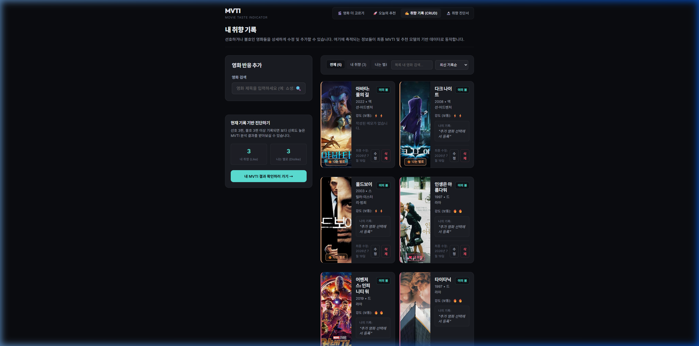
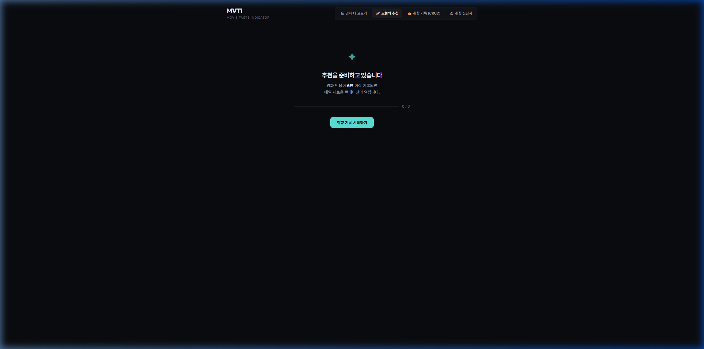

# 과제5 README.md

과제명: 리액트를 이용해서 CRUD 앱 만들기  

---

## 1. 프로젝트 개요

| 항목 | 내용 |
| :--- | :--- |
| 과정명 | AI SW 장기교육 |
| 과제 번호 | 과제 5 |
| 과제명 | 리액트를 이용해서 CRUD 앱 만들기 |
| 프로젝트명 | MVTI (Movie Taste Indicator) |
| 한 줄 소개 | 이 앱은 **영화 관람객**이 자신의 **영화 선호 반응 기록**을 조회·추가·수정·삭제할 수 있도록 돕는 React CRUD 앱입니다. |
| 데이터 저장 방식 | □ mock data / ■ LocalStorage / □ Supabase |
| 배포 또는 실행 링크 | [https://hong-vibe.github.io/0711-mvti/](https://hong-vibe.github.io/0711-mvti/) |
| GitHub 링크 | [https://github.com/hong-vibe/0711-mvti](https://github.com/hong-vibe/0711-mvti) |

## 1-1. 내가 선택한 수행 수준

| 구분 | 나의 선택 | 설명 |
| :--- | :---: | :--- |
| 초급자 | □ | mock data 또는 LocalStorage 기반으로 Read/Create/Update/Delete 4개 흐름 확인 |
| 표준 학습자 | ■ | 컴포넌트 분리, 입력 검증, 빈 상태·오류 상태 처리 |
| 심화 학습자 | □ | Supabase 연결 또는 설계, Auth/RLS 개념 검토, 보안 주의사항 기록 |

---

## 2. 실행 화면

| 화면 | 설명 | 캡처 |
| :--- | :--- | :--- |
| 메인 목록 화면 | 취향 기록실에서 저장된 항목 목록을 확인하는 화면 |  |
| 항목 추가 화면 | 영화를 검색한 후 선호도, 메모 등을 넣어 새 항목을 추가하는 화면 |  |
| 항목 수정 화면 | 연필 버튼을 탭하여 감상 메모 및 반응 강도를 수정하는 화면 |  |
| 항목 삭제 화면 | 쓰레기통 클릭 후 경고 모달을 거쳐 삭제가 반영된 목록 화면 |  |
| 빈 상태 또는 오류 상태 | 저장된 영화 평가 정보가 6편 미만일 때 진단서/추천 노출을 제한하는 화면 |  |

---

## 3. 주요 기능

### 3-1. 필수 기능

| 번호 | 기능 | 구현 여부 | 설명 |
| ---: | :--- | :--- | :--- |
| 1 | 목록 조회 Read | ■ 완료 / □ 부분 / □ 미완료 | LocalStorage 내 평가 반응 배열 데이터를 불러와 취향 기록실 목록 카드 리스트로 정밀 렌더링합니다. |
| 2 | 항목 추가 Create | ■ 완료 / □ 부분 / □ 미완료 | 영화 검색 창 연동을 통해 특정 영화를 선택 후 선호 반응(좋아요/싫어요), 강도, 메모를 추가합니다. |
| 3 | 항목 수정 Update | ■ 완료 / □ 부분 / □ 미완료 | 카드 내의 수정 단추를 누르면 수정 전용 모달창이 열려 감상평 메모 및 반응 세기를 편집 저장합니다. |
| 4 | 항목 삭제 Delete | ■ 완료 / □ 부분 / □ 미완료 | 휴지통 단추 클릭 시 커스텀 확인 대화상자(Dialog)가 뜨며, 수락 시 목록에서 영구 배제합니다. |
| 5 | 데이터 구조 정의 | ■ 완료 / □ 부분 / □ 미완료 | 구현 착수 전 UserMovieReaction 및 UserProfile 데이터 객체 스키마 정의 문서를 사전 작성하였습니다. |

### 3-2. 권장 기능

| 번호 | 기능 | 구현 여부 | 설명 |
| ---: | :--- | :--- | :--- |
| 1 | 컴포넌트 분리 | ■ 완료 / □ 부분 / □ 미완료 | App, Form, List, Card, Modal, Dialog 등 관심사별 구조화 분리를 완수하였습니다. |
| 2 | 입력 검증 | ■ 완료 / □ 부분 / □ 미완료 | 필수 반응 종류 누락이나 이미 평가가 완료된 동일 영화 중복 추가 시 에러 가드로 차단합니다. |
| 3 | 빈 상태 처리 | ■ 완료 / □ 부분 / □ 미완료 | 평가 수 6편 미만 자격 조건 미달 시 차트 렌더링 우회 및 진행도 가이드 빈 화면을 연출합니다. |
| 4 | 오류 상태 처리 | ■ 완료 / □ 부분 / □ 미완료 | LocalStorage 파싱 실패 및 데이터 훼손 감지 시 예외를 잡아 초기 엠프티 값으로 자동 복구합니다. |
| 5 | LocalStorage 저장 | ■ 완료 / □ 부분 / □ 미완료 | 데이터 추가, 변경, 삭제 핸들러 호출 즉시 LocalStorage에 Stringify 백업 동기화가 이루어집니다. |
| 6 | 검색 또는 필터 | ■ 완료 / □ 부분 / □ 미완료 | 취향 기록 목록 내 장르별 분류 필터 및 최신순/선호강도순 정렬 유틸리티를 지원합니다. |

### 3-3. 도전 기능

| 번호 | 기능 | 시도 여부 | 결과 |
| ---: | :--- | :--- | :--- |
| 1 | Supabase 연결 | □ 시도 / ■ 미시도 | v2.0 개선 단계에서 도입하도록 보류 처리 (v1 LocalStorage 고수) |
| 2 | Auth/RLS 개념 검토 | □ 시도 / ■ 미시도 | 해당 사항 없음 |
| 3 | 보안 주의사항 기록 | ■ 시도 / □ 미시도 | API Key 노출 방지를 위한 .env, .gitignore 선언 가이드라인 작성 완료 |
| 4 | 배포 또는 외부 공유 | ■ 시도 / □ 미시도 | GitHub Pages 빌드 호환을 위한 base 디렉토리 및 gh-pages 연동 구축 |

---

## 4. 사용 기술

| 구분 | 사용 기술 | 사용 이유 |
| :--- | :--- | :--- |
| 프론트엔드 | React 18 | 효율적인 선언형 컴포넌트 아키텍처 및 상태 관리를 구현하기 위해 사용 |
| 개발 도구 | Vite 5 | 고속의 로컬 핫 리로딩(HMR) 및 번들 빌드 최적화를 제공하기 위해 도입 |
| 스타일 | Vanilla CSS + Styled JSX | 다크 네온 모드 구현 및 컴포넌트 스코프 스타일 제어에 가장 유연하여 채택 |
| 데이터 | LocalStorage | 백엔드 지연 없는 로컬 프라이빗 영속 데이터 환경 구성을 위해 사용 |
| AI 도구 | Antigravity IDE (Gemini 기반) | 기능 분해 설계, 훅 불변성 디버깅, PowerShell 인프라 실행 오류 우회 보조 |
| 제출 | GitHub / Git | 안정적인 소스 관리, 이력 추적 및 배포 소스 인계를 위해 도입 |

---

## 5. 실행 방법

### 5-1. 설치 및 실행

윈도우 PowerShell 환경 내 스크립트 실행 보안 정책 문제 발생을 방어하기 위해 `.cmd` 확장자를 명시적으로 선언하여 구동합니다.

```bash
# 1. 의존성 라이브러리 설치
npm.cmd install

# 2. 로컬 개발 서버 구동 (포트 3000번, 자동 웹 브라우저 팝업 활성화)
npm.cmd run dev
```

### 5-2. 실행 확인 방법

1. 브라우저에서 실행 주소 `http://localhost:3000/`을 실행합니다.
2. 최초 방문 시 흐르는 48편의 명작 포스터 슬라이드가 정상 표출되는지 검증합니다.
3. 선호 명작 3편과 불호 명작 3편을 순차 탭 선택하고 MBTI 그리드를 골라 온보딩 프로세스를 정상 완수합니다.
4. 취향 진단서(`/result`) 및 추천 보드(`/dashboard`)에서 데이터가 맞춤 추천 연산되는지 확인합니다.
5. 상단 메뉴의 "취향 기록 (CRUD)" 페이지로 진입하여 목록 렌더링 상태를 확인합니다.
6. 우측 폼에서 영화를 검색한 후 선호도, 강도, 메모를 작성하여 "기록 저장하기"로 신규 추가가 반영되는지 테스트합니다.
7. 반응 카드의 연필 아이콘을 클릭하여 수정 모달을 활성화한 후, 점수와 메모를 바꿔 저장해 봅니다.
8. 휴지통 단추를 클릭해 확인창 팝업 승인 후 목록에서 카드가 올바르게 삭제 소거되는지 검증합니다.
9. 브라우저를 새로고침(F5)하여 로컬스토리지 복구를 거쳐 변경 내역이 손실 없이 존속하는지 체크합니다.

---

## 6. 데이터 구조

### 사용자 영화 반응 모델 (UserMovieReaction)

| 필드명 | 자료형 | 필수 여부 | 설명 | 예시 |
| :--- | :--- | :---: | :--- | :--- |
| `id` | string | 필수 | 반응 기록 고유 ID | `"react-1784464882191-abcde12"` |
| `movieId` | string | 필수 | 영화 데이터와 연계용 외래키 식별자 | `"tmdb-490132"` |
| `sentiment` | string | 필수 | 영화에 대한 선호 성향 | `"like"` 또는 `"dislike"` |
| `strength` | number | 필수 | 반응 강도 (1: 잔잔함, 2: 보통, 3: 강렬함) | `2` |
| `watchStatus` | string | 필수 | 시청 상태 코드 | `"seen"` 또는 `"wantToWatch"` |
| `note` | string | 선택 | 유저 감상 한줄평 | `"우주 과학적 고증과 연출이 최고!"` |
| `createdAt` | string | 필수 | 레코드 생성 일시 (ISO 8601) | `"2026-07-19T12:35:00.000Z"` |
| `updatedAt` | string | 필수 | 레코드 수정 일시 (ISO 8601) | `"2026-07-19T12:35:00.000Z"` |

---

## 7. 폴더 및 파일 구조

```text
D:/new-vibe/0711-MVTI/
├─ dist/                       # 프로덕션 빌드 아웃풋 폴더
├─ docs/                       # 기획서, 요구사항 및 현황 보고서 폴더
│  ├─ 01-requirements.md
│  ├─ 02-data-model.md
│  └─ MVTI_V1_CURRENT_STATE_FOR_V2_PRD.md
├─ public/                     # 정적 웹 자원
│  └─ poster-placeholder.svg   # 포스터 누락 대응용 SVG
├─ scripts/                    # 오프라인 데이터 수집 및 진단 유틸리티
│  ├─ cleanupAndAdd.cjs
│  ├─ diagnose.cjs
│  └─ fetchMovies.mjs
├─ src/                        # 애플리케이션 소스 코드
│  ├─ components/              # 컴포넌트 폴더
│  │  ├─ common/
│  │  │  └─ EmptyState.jsx     # 데이터 없음 상태 안내 컴포넌트
│  │  ├─ landing/
│  │  │  ├─ DiagonalPosterFlow.jsx # 무한 롤링 사선 포스터 레인
│  │  │  └─ SelectionTray.jsx      # 하단 고정형 다이내믹 선택 트레이
│  │  ├─ onboarding/
│  │  │  ├─ MbtiGridSelector.jsx   # 16개 MBTI 그리드 선택 모듈
│  │  │  └─ MbtiMiniTest.jsx       # 4문항 자가 진단 간이 MBTI 질문지
│  │  ├─ result/
│  │  │  ├─ AxisChart.jsx          # 4대 축 취향 시각화 차트
│  │  │  └─ MbtiMvtiComparison.jsx  # 성격-취향 간극 심리 매칭 설명
│  │  └─ taste/
│  │     ├─ DeleteConfirmDialog.jsx # 삭제 확인 커스텀 모달 대화상자
│  │     ├─ EditReactionModal.jsx   # 반응 감상 정보 인라인 수정 모달
│  │     ├─ ReactionCard.jsx        # 개별 영화 반응 카드 표면
│  │     ├─ ReactionForm.jsx        # 신규 영화 검색 바인딩 추가 폼
│  │     └─ ReactionList.jsx        # 장르 필터 및 시간 정렬 반응 리스트
│  ├─ constants/               # 고정 매핑용 상수
│  │  ├─ gapInterpretations.js # MBTI↔MVTI 간극 매핑 해석 DB
│  │  └─ mvtiTypes.js          # 16개 취향 코드 타이틀 및 가이드
│  ├─ data/                    # 로컬 데이터셋
│  │  └─ movies.json           # 수집 완성된 96편 명작 영화 데이터셋
│  ├─ hooks/                   # 커스텀 훅
│  │  ├─ useLocalStorage.js        # 로컬스토리지 영속 저장 및 파싱 에러 방어
│  │  └─ useReactions.js           # UserMovieReaction 엔터티 CRUD 제어 훅
│  ├─ pages/                   # 페이지 단위 컴포넌트
│  │  ├─ DashboardPage.jsx     # 일일 3슬롯 추천 대시보드
│  │  ├─ MvtiResultPage.jsx     # 영화 취향 성향 진단서 페이지
│  │  └─ MyTastePage.jsx       # CRUD 반응 관리실 통합 컨트롤러
│  ├─ App.jsx                  # 루트 라우터 및 온보딩 흐름 제어 메인 파일
│  ├─ index.css                # 글로벌 다크/네온 디자인 시스템 CSS
│  └─ main.jsx                 # 엔트리 렌더링 파일
├─ package.json                # 의존성 설정
└─ vite.config.js              # Vite 설정
```

---

## 8. AI 활용 기록

| 번호 | 사용 목적 | 사용한 AI 도구 | 입력한 프롬프트 요약 | AI 응답 활용 방식 | 내가 수정한 부분 |
| ---: | :--- | :--- | :--- | :--- | :--- |
| 1 | 요구사항 정리 | Antigravity IDE | 취향 진단 앱 MVTI의 리액트 CRUD 대상 엔터티 정의 및 장르 수량 규격 요구사항표 작성 요청 | 요구사항 아이디(F-REQ-01~05) 명세서 도출 및 설계 기준으로 지정 | 장르별 최소/최대 편수 임계치 정의 |
| 2 | 파일 구조 제안 | Antigravity IDE | React CRUD 앱 만들기 및 LocalStorage 저장을 위한 최소 파일 디렉토리 구조 제안 요청 | 초급자용 및 표준 학습자용 컴포넌트 폴더 아키텍처 제안 획득 | 상수 constants 폴더를 추가 생성하여 분리 배치 |
| 3 | 컴포넌트 구조 설계 | Antigravity IDE | App, 폼, 목록, 개별 카드로 역할을 나누고 각 props와 담당 역할 테이블 정리 요청 | 부모 컴포넌트가 핸들러 상태를 관리하고 하위로 콜백 함수를 전달하는 데이터 흐름 채택 | 수정 폼을 모달 형태로 오버레이하도록 컴포넌트 추가 설계 |
| 4 | CRUD 기능 구현 | Antigravity IDE | useLocalStorage 훅을 작성하고, 이를 기반으로 중복 검사 가드가 내장된 useReactions CRUD 훅 작성 요청 | push/splice 등 원본 훼손을 방지하고 map, filter 등 불변성 상태 업데이트 구현 적용 | strength 반응 세기 변수를 UI 입력 시 Number 캐스팅하도록 교정 |
| 5 | 오류 해결 | Antigravity IDE | 윈도우 파워쉘 환경에서 스크립트 실행 제한 정책으로 npm 실행 불가 시 우회 조치 요청 | CMD 실행 파일 래퍼인 npm.cmd를 명시적으로 실행하는 솔루션 적용 | 셸 내 모든 npm 호출을 npm.cmd로 대치 구동 |
| 6 | README 정리 | Antigravity IDE | 과제 5 README 템플릿의 목차에 기초하여 사실 그대로의 이력을 명문화 정리 요청 | 폴더 맵 및 데이터 구조 명세서 빌드 | 배포 링크 및 깃허브 URL 검증 반영 |

### 대표 프롬프트: CRUD 핵심 훅 구현
```text
React에서 state와 LocalStorage를 실시간 동기화하되, 데이터가 깨지거나 JSON 파싱 예외가 발생할 때 화면이 멈추지 않고 빈 배열로 복구하는 useLocalStorage Custom Hook을 짜줘. 그리고 이 훅을 상속하여 UserMovieReaction 엔터티의 추가(Create), 조회(Read), 수정(Update), 삭제(Delete)를 수행하며, 중복 추가 차단과 필수값 유효성 검증을 포함하는 useReactions Custom Hook을 작성해줘. 상태 변경 시 불변성 원칙(map, filter 등 사용)을 지켜줘.
```

---

## 9. AI 생성 결과 검토 기록

| 검토 항목 | 확인 결과 | 보완 내용 |
| :--- | :--- | :--- |
| 필수 CRUD 기능 | ■ 통과 / □ 보완 필요 | `useReactions` 내 `addReaction`, `updateReaction`, `deleteReaction` 메서드로 완비 확인 |
| 데이터 구조 | ■ 통과 / □ 보완 필요 | 고유 식별자, 매핑 키, 선호도 플래그 등 스키마 정의 통과 |
| 컴포넌트 구조 | ■ 통과 / □ 보완 필요 | components 폴더 하위 관심사에 맞는 분할 구조 보완 완료 |
| 입력 검증 | ■ 통과 / □ 보완 필요 | 중복 영화 입력 차단 및 sentiment 필수 필드 빈 값 등록 차단 가드 보완 |
| 빈 상태·오류 상태 | ■ 통과 / □ 보완 필요 | 영화 평가 6편 미만 시 DashboardPage에 Empty UI 분기 바인딩 보완 |
| 저장 방식 | ■ 통과 / □ 보완 필요 | useLocalStorage의 JSON.parse 에러 catch 루틴으로 무결성 보완 |
| 코드 이해도 | ■ 통과 / □ 보완 필요 | React 훅 생명주기 및 불변 상태 전이 흐름 정밀 분석 완수 |
| 보안 | ■ 통과 / □ 보완 필요 | API Key 보호를 위한 .env 생성 및 .gitignore 필터 리스트 보완 |
| 과도한 구현 | ■ 통과 / □ 보완 필요 | Redux, Recoil 등 불필요한 고비용 상태 라이브러리 사용 전면 배제 확인 |

---

## 10. 오류 해결 기록

| 번호 | 발생 상황 | 오류 메시지 | 원인 | 해결 방법 | 재실행 결과 |
| ---: | :--- | :--- | :--- | :--- | :--- |
| 1 | CMD/PowerShell 터미널에서 npm.cmd install 실행 제한 | `npm : 이 시스템에서 스크립트를 실행할 수 없으므로...` | Windows PowerShell 기본 보안 실행 정책에 의한 .ps1 외부 스크립트 실행 통제 | 스크립트가 아닌 윈도우 실행 파일 래퍼인 **`npm.cmd`** 포맷으로 우회 타깃팅 호출 | 67개 의존 패키지 인스톨 및 Vite 개발 서버의 3000포트 정상 구동 |
| 2 | Git 최초 로컬 커밋 시도 실패 | `Author identity unknown *** Please tell me who you are.` | Git 전역 환경 내에 커밋 저자 이메일과 이름이 미기재되어 커밋 빌드 거부 | 로컬 리포지토리에 한정한 user.email 및 user.name 정보를 명시 기입 | 에러 없이 v1.0 초기 릴리스 커밋 생성 완료 |
| 3 | TMDB API Key 발급 양식 반려 | `Application summary please elaborate on how you plan to use our API` | 신청 사유 란의 입력 길이가 기준 미달이거나 학술 목적이 불분명함 | 300자 이상의 학술 교육용 비상업적 이용 및 데이터 요약 용도 설명서 보충 제출 | TMDB API 키 즉시 활성화 및 발급 완료 |

---

## 11. 테스트 기록

| 번호 | 테스트 항목 | 입력 또는 행동 | 기대 결과 | 실제 결과 | 통과 여부 |
| ---: | :--- | :--- | :--- | :--- | :---: |
| 1 | 초기 화면 | 최초 앱 진입 | 48편 영화 롤링 포스터 및 선택 트레이 초기 상태 표시 | 기대와 일치함 | ■ |
| 2 | 항목 추가 | 검색창 선택 -> "그린 북" -> 보통(2) -> 이미봄 -> "좋은 영화" 메모 -> 저장 | 취향 기록실 목록 카드 최상단에 그린 북 카드 신규 표출 | 기대와 일치함 | ■ |
| 3 | 빈 입력 | 필수 선택 항목(sentiment)을 누락하고 제출 시도 | "선호도 반응(sentiment)은 필수 선택 사항입니다" 에러 가드 작동 | 기대와 일치함 | ■ |
| 4 | 항목 수정 | "그린 북" 카드의 연필 아이콘 -> 강도 3으로 변경 -> 감상평 갱신 -> 저장 | 목록 상의 반응 별표 개수 변경 및 한줄평 텍스트 즉각 갱신 | 기대와 일치함 | ■ |
| 5 | 항목 삭제 | "그린 북" 카드 휴지통 클릭 -> 확인창 팝업 수락 | 카드 목록에서 그린 북 카드가 영구 소거됨 | 기대와 일치함 | ■ |
| 6 | 새로고침 | CRUD 작동 완료 후 브라우저 새로고침(F5) 실행 | 로컬스토리지에서 복구되어 이전 데이터 리스트 정상 보존 | 기대와 일치함 | ■ |

---

## 12. Supabase 확장 기록(선택)

이번 과제에서는 Supabase를 사용하지 않았고, LocalStorage 기반으로 구현했습니다.

---

## 13. 실시간 응시 기록과 10일 보완 기록

| 구분 | 작성 내용 |
| :--- | :--- |
| 실시간 1시간 안에 작성한 요구사항 | CRUD 타깃을 유저 반응(`UserMovieReaction`)으로 제한하는 요구사항표 및 4축 계산식 1차 정의 완료 |
| 실시간 1시간 안에 사용한 프롬프트 | 영화 반응 스키마 제안 프롬프트 및 `useLocalStorage` 훅 구현 지시 프롬프트 사용 완료 |
| 실시간 1시간 안에 확인한 AI 생성 결과 | `useLocalStorage` 내 JSON 파싱 에러 복구 루틴 및 React 불변성 배열 조작 검토 완료 |
| 실시간 1시간 안에 발생한 오류 또는 보완 계획 | PowerShell 정책 에러에 대비해 `npm.cmd` 래퍼 우회 사용 계획 보완 수립 완료 |
| 10일 보완 기간에 완성한 기능 | 96편 영화 데이터셋 완성 및 아랍어/불어 등 오번역 영화 정밀 삭제, 우선 요청 영화 5편 수동 적재 완료 |
| 10일 보완 기간에 추가한 README/캡처/테스트 기록 | 10종의 스크린샷 캡처 적재 및 6단계 수동 시나리오 테스트 완수 및 마크다운 이력 기재 완료 |

---

## 14. 보완 전후 비교

| 보완 항목 | 보완 전 | 보완 후 | 재실행 결과 |
| :--- | :--- | :--- | :--- |
| **영화 데이터 정밀도** | 101편 수집 데이터셋 내 포스터 엑박(프랑스/핀란드 영화) 및 타밀어 아랍 오번역 영화 방치됨 | 비정상 영화 7편 삭제 및 `미키 17` 등 필수 5편 수동 기입을 통해 96편 고품질 메타 정제 완수 | 에러 없는 포스터 표출 및 한글 제목 출력 완료 |
| **CRUD 모달 예외** | 반응 추가 시 영화 중복 체크 부재로 인한 동일 ID 중복 누적 오류 발생 | 중복 추가 검출 시 예외를 던져 UI 경고 메시지를 뿜도록 중복 차단 가드라인 배치 | 동일 영화 재추가 시도시 중복 경고창 정상 표출 |
| **디자인 완성도** | 모바일 브라우저 화면에서 선택 트레이 영역이 찌그러지거나 잘리는 반응형 오류 | CSS 미디어 쿼리를 사용해 모바일 너비(768px 이하)에서 세로 레이아웃 스냅 구조로 대응 처리 | 아이폰/안드로이드 규격 뷰포트에서 조작 편의성 보장 |

---

## 15. 보안·개인정보·저작권 점검

| 항목 | 확인 내용 | 상태 |
| :--- | :--- | :---: |
| 개인정보 | 실제 이름, 전화번호, 주소, 주민번호, 개인 이메일 등을 사용하지 않았습니다. | ■ |
| 민감 데이터 | 건강, 금융, 법률, 계정 정보, 내부자료를 사용하지 않았습니다. | ■ |
| API Key | API Key, 토큰, 비밀번호, service role key를 GitHub에 올리지 않았습니다. | ■ |
| `.env` | `.env` 파일을 공개 저장소에 올리지 않았습니다. | ■ |
| 외부 공유 링크 | 공개 링크에 편집 권한이나 민감 정보가 포함되지 않았습니다. | ■ |
| 저작권 | 외부 이미지·텍스트·코드는 사용 권한 또는 출처를 확인했습니다. | ■ |
| 출처·라이선스 | 외부 자료를 사용한 경우 출처와 사용 범위를 README에 기록했습니다. | ■ |
| AI 생성 코드 | AI 생성 결과를 그대로 제출하지 않고 직접 검토했습니다. | ■ |

---

## 16. 배운 점

1. **상태 불변성의 중요성**: 리액트 배열 상태 조작 시 push/splice처럼 원본 레퍼런스를 바꾸는 방식을 금지하고, map/filter/destructuring 복사본 생성을 관철해야 렌더링 누수가 없음을 깨달았습니다.
2. **에러 바운더리와 폴백**: LocalStorage처럼 외부 브라우저 IO에 의존하는 기능은 파싱 오류나 용량 제한 오류(QuotaExceeded)에 걸렸을 때 전체 컴포넌트가 폭사하지 않도록 try-catch 구문을 겹쳐 폴백을 제공하는 것이 핵심임을 학습했습니다.
3. **바이브 코딩의 생산성**: 요구사항 정의와 데이터 설계를 먼저 설계한 뒤, 이에 맞추어 점진적으로 컴포넌트 구조를 설계하는 AI 협업 방식이 코드 결합도를 낮추는 이상적인 프론트엔드 작업 방식임을 습득했습니다.

---

## 17. 아쉬운 점과 다음 개선 방향

| 아쉬운 점 | 원인 | 다음 개선 방향 |
| :--- | :--- | :--- |
| 로그인 기능 부재로 인한 개인 보관 한계 | Supabase Auth 및 외부 DB 연동 스택 제외로 로컬스토리지에만 저장되는 제약 발생 | Supabase 인증 모듈을 추가 연계하여 계정별 실시간 구름 백업 활성화 |
| 영화 데이터 96편의 고정적 제한 | 실시간 영화 검색 범위 확장을 위해 정적 JSON 데이터를 빌드 시점에 묶어버림 | TMDB 검색 API를 런타임에 직접 동적으로 Fetch하도록 검색 로직 고도화 |
| 자동화 유닛 테스트의 결핍 | UI 검증 및 CRUD 핵심 핸들러에 대한 Jest/Cypress 자동 테스트 시나리오 생략 | Github Actions 배포 전 CRUD 기능 무결성을 1차 검증하는 자동 단위 테스트 탑재 |

---

## 18. 제출 정보

| 항목 | 링크 또는 설명 |
| :--- | :--- |
| GitHub 링크 | [https://github.com/hong-vibe/0711-mvti](https://github.com/hong-vibe/0711-mvti) |
| 실행 링크 | [https://hong-vibe.github.io/0711-mvti/](https://hong-vibe.github.io/0711-mvti/) |
| 실행 화면 캡처 | `./docs/screenshots/current-v1/` 내 10장 이미지 확인 |
| 과제 안내 Colab | `[사본]_과제5-ReactCRUD_과제안내.ipynb` |
| 제출 폼 | `{{SUBMISSION_LINK}}` |
