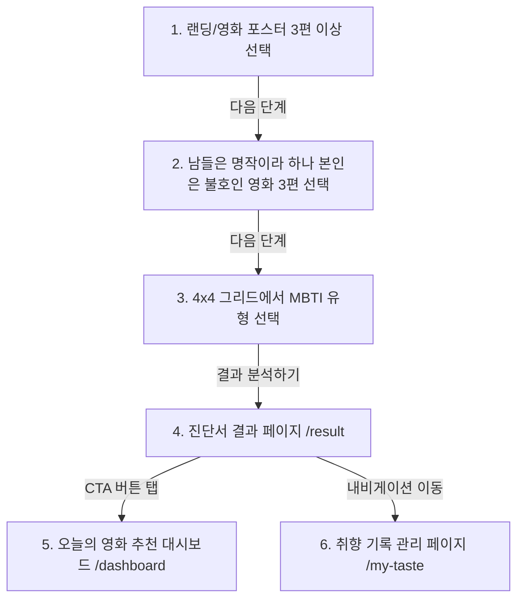

# MVTI MVP v1.0 현황 분석 및 v2.0 PRD 인계 문서

## 1. Executive Summary

본 문서는 MVTI MVP v1.0의 현재 소스 코드 구조, 실행 환경, 영화 데이터셋 품질, 상태 관리 방식 및 추천 엔진 구현 현황을 철저히 조사하여 기록한 현황 분석서입니다. 본 현황 조사는 코드를 임의로 수정하지 않고 있는 그대로 수치적·기능적으로 분석하는 것을 원칙으로 하였으며, 향후 v2.0 PRD(Product Requirements Document)를 작성하는 데 신뢰할 수 있는 기초 데이터를 제공합니다.

### MVP v1.0 핵심 요약
* **동작 정의**: 사용자가 좋아하는 영화 3편, 남들은 좋아하나 본인은 불호하는 영화 3편을 선택하고 MBTI를 입력하면 사용자의 영화 취향 성향인 **MVTI 코드**를 진단하고, 이에 맞는 **일일 추천 영화 3편**을 매일 다른 시드로 큐레이션하여 제공하는 React 싱글 페이지 애플리케이션(SPA)입니다.
* **정상 동작 핵심 기능**:
  - 롤링 포스터 슬라이드를 활용한 다이내믹 영화 선택 및 트레이 바인딩
  - MBTI 그리드 기반 입력 연동 및 LocalStorage 기반 사용자 프로필 저장
  - 4개 취향 축 계산 및 16가지 성향 유형 진단서 매핑
  - 유클리드 거리를 기반으로 한 3개 추천 슬롯(정확 매칭, 취향 확장, 의외의 발견) 생성
  - 취향 기록 페이지의 완전한 CRUD 기능 (반응 추가, 목록 필터/정렬, 수정 모달, 삭제 다이얼로그)
* **불완전하거나 미작동 기능**:
  - `window.confirm` 대화 상자로 인한 자동화 테스트 환경에서의 데이터 초기화 실패 장벽
  - MBTI 입력 후 결과 페이지에서 영화 반응을 삭제하여 평가 개수가 6개 미만이 되었을 때, 결과 및 대시보드 페이지 진입은 유지되나 내부 컨텐츠가 "기록 부족 미자격 화면"으로만 노출되는 예외 흐름
  - MBTI를 개별 수정하는 화면의 부재 (데이터를 완전히 삭제하는 전체 초기화만 지원)
* **현재 추천 방식의 핵심**: 영화별 기하학적 4축 점수와 사용자의 종합 취향 벡터 간 **유클리드 거리(Euclidean Distance)**가 가까운 상위 5개 풀을 구성한 후, 날짜 시드로 매칭하여 노출하는 방식입니다.
* **v2 전환 시 3대 기술 위험**:
  1. **MovieLens 평점 매핑을 위한 ID 부재**: 영화 데이터셋에 IMDb ID 및 MovieLens ID가 전혀 없어 공동 선호 필터링 추천 엔진 구축을 위한 데이터 매핑의 병목 발생
  2. **LocalStorage와 클라우드/DB 미동기화**: 사용자 반응 데이터가 전적으로 LocalStorage에만 영속화되어 있어 다중 기기 환경에서 동기화 불가 및 데이터 유실 위험
  3. **영화 풀 확장 시 로딩 성능 저하**: 현재 약 96편의 영화 데이터를 빌드 타임에 번들링된 단일 정적 JSON 파일로 로드하고 있어, 영화 데이터 수천~수만 편 확장 시 네트워크 및 메모리 점유 극대화
* **재사용 가치가 높은 상위 5개 자산**:
  1. **[useReactions.js](file:///D:/new-vibe/0711-MVTI/src/hooks/useReactions.js)**: 상태 불변성을 엄격히 준수한 완성도 높은 CRUD 커스텀 훅
  2. **[DiagonalPosterFlow.jsx](file:///D:/new-vibe/0711-MVTI/src/components/landing/DiagonalPosterFlow.jsx)**: 무한 롤링 및 사선 역보정이 적용된 트렌디한 포스터 플로우 UI
  3. **[SelectionTray.jsx](file:///D:/new-vibe/0711-MVTI/src/components/landing/SelectionTray.jsx)**: 온보딩 진행률을 동적으로 렌더링하고 상태 취소를 지원하는 트레이 컴포넌트
  4. **[index.css](file:///D:/new-vibe/0711-MVTI/src/index.css)**: 다크 모드에 최적화된 토큰 및 네온 칼라 변수 디자인 시스템
  5. **[mvtiTypes.js](file:///D:/new-vibe/0711-MVTI/src/constants/mvtiTypes.js)**: 16개 취향 유형에 대해 친근하고 완성도 높게 작성된 한글 설명 텍스트 상수
* **PRD 작성 전 결정 핵심 질문**:
  - v2 추천에서 회원 로그인과 DB/Supabase 연동을 필수 조건으로 강제할 것인가?
  - 추천을 위해 MovieLens 데이터셋의 공동 선호 관계를 어떤 아키텍처(클라이언트 로컬 연산 vs 백엔드 API 서버)로 처리할 것인가?

---

## 2. Git 및 저장소 상태

저장소 검증 명령(`git status`, `git log` 등)을 실행한 결과를 표로 정리하였습니다.

| 항목 | 현재 값 | 근거 |
|---|---|---|
| 현재 브랜치 | `develop/v1.1` | `git branch --show-current` 실행 결과 |
| 최신 커밋 | `91641d4 release: complete MVTI v1.0` | `git log -n 1` 해시 `91641d45c58a...` |
| 작업 트리 상태 | modified (14개 파일) / untracked (4개 파일) | `git status` 실행 결과 |
| v1.0 태그 존재 여부 | 존재함 (`v1.0` 태그가 `91641d4` 커밋에 매핑됨) | `git tag` 실행 결과 |
| 원격 저장소 연결 여부 | `origin/main` (연결되어 있음) | `git branch -a` 및 원격 추적 브랜치 검증 |
| 주요 브랜치 | `develop/v1.1` (현재 작업 중), `main` | `git branch -a` 실행 결과 |
| 현재 버전 표기 위치 | `package.json`의 `"version": "0.1.0"` | `package.json` 파일의 `version` 필드 |

### 작업 트리 보존 및 동기화 위험성 분석
* **v1.0 복구 안정성**: 최신 릴리스 커밋에 `v1.0` 태그가 명시되어 있어 언제든 `git checkout v1.0` 명령을 통해 완전한 복구가 가능한 안전한 상태입니다.
* **작업 트리 미커밋 상태**: 현재 로컬 작업 디렉토리에는 14개의 소스 코드 파일(movies.json, App.jsx, index.css, 여러 페이지 및 컴포넌트)이 modified 상태로 스테이징되지 않은 채 존재하며, 4개의 설정/지시서 파일이 untracked 상태입니다.
* **추적 금지 파일의 Git 포함 여부**: `.env` 및 `node_modules/` 등 민감성 환경 변수나 의존성 폴더는 [.gitignore](file:///D:/new-vibe/0711-MVTI/.gitignore)에 적절히 선언되어 Git 추적에서 제외되어 있습니다.
* **기기 간 충돌 위험 파일**: React CRUD 반응들이 저장되는 로컬스토리지는 브라우저 내부 샌드박스에 저장되므로 Git 충돌을 일으키지 않으나, `package-lock.json` 및 `src/data/movies.json`은 기기 간 소스 동기화 과정에서 개행 문자(LF vs CRLF) 차이 등으로 충돌 가능성이 비교적 큽니다.

---

## 3. 실행 환경과 기술 스택

[package.json](file:///D:/new-vibe/0711-MVTI/package.json) 및 의존성 모듈 분석에 따른 현재 기술 스택 현황입니다.

* **React 버전**: `^18.3.1` (React 18)
* **빌드 도구**: Vite `^5.3.4` (Vite 5, [vite.config.js](file:///D:/new-vibe/0711-MVTI/vite.config.js) 설정 포트: 3000)
* **개발 언어**: JavaScript (TypeScript 미적용, JSX 확장자 사용)
* **라우터**: `react-router-dom` `^7.18.1` (React Router v7)
* **상태 관리**: 컴포넌트 내의 Local State 및 커스텀 훅을 통한 동기화 (전역 상태 라이브러리 미도입)
* **CSS 적용 방식**: Vanilla CSS + CSS-in-JS 스타일의 Styled JSX (`<style jsx>` 구문 적용)
* **아이콘 / 애니메이션**: 외부 라이브러리 없이 네이티브 이모지 및 CSS `@keyframes` 무한 롤링 트랜지션 활용
* **데이터 저장 방식**: 브라우저 `window.localStorage` 기반 영속화 및 정적 `movies.json` 로드
* **외부 API**: TMDB API 호출 환경(사전 연동 준비용 `.env.example` 및 수집 스크립트 존재, 실제 런타임에는 미연결)
* **Supabase 사용 여부**: package.json 의존성 상에 없으며, 현재 코드상에서도 사용하지 않음

### 주요 기술/패키지 상세 표
| 기술/패키지 | 버전 | 실제 사용 위치 | v2 재사용 판단 |
|---|---:|---|---|
| `react` | `^18.3.1` | 프로젝트 전역 | 재사용 (기반 스택 유지) |
| `react-router-dom` | `^7.18.1` | [App.jsx](file:///D:/new-vibe/0711-MVTI/src/App.jsx) 라우팅 | 재사용 (라우팅 계층 재활용) |
| `vite` | `^5.3.4` | 개발 서버 및 프로덕션 빌드 | 재사용 |
| `@vitejs/plugin-react`| `^4.3.1` | Vite 리액트 플러그인 | 재사용 |

---

## 4. 실제 프로젝트 파일 구조

의미 있는 디렉토리와 소스 코드를 중심으로 구성한 물리 파일 트리 구조입니다.

```text
D:/new-vibe/0711-MVTI/
├─ dist/                       # 프로덕션 빌드 아웃풋 폴더
├─ docs/                       # 기획서, 요구사항 및 현황 보고서 폴더
│  ├─ 01-requirements.md
│  ├─ 02-data-model.md
│  └─ MVTI_V1_CURRENT_STATE_FOR_V2_PRD.md  (본 문서)
├─ public/                     # 정적 웹 자원
│  └─ poster-placeholder.svg   # 포스터 누락 대응용 SVG
├─ scripts/                    # 오프라인 데이터 수집 및 진단 유틸리티
│  ├─ cleanupAndAdd.cjs
│  ├─ diagnose.cjs
│  └─ fetchMovies.mjs
├─ src/                        # 애플리케이션 소스 코드
│  ├─ components/              # 컴포넌트 폴더
│  │  ├─ common/
│  │  │  └─ EmptyState.jsx
│  │  ├─ landing/
│  │  │  ├─ DiagonalPosterFlow.jsx
│  │  │  └─ SelectionTray.jsx
│  │  ├─ onboarding/
│  │  │  ├─ MbtiGridSelector.jsx
│  │  │  └─ MbtiMiniTest.jsx
│  │  ├─ result/
│  │  │  ├─ AxisChart.jsx
│  │  │  └─ MbtiMvtiComparison.jsx
│  │  └─ taste/
│  │     ├─ DeleteConfirmDialog.jsx
│  │     ├─ EditReactionModal.jsx
│  │     ├─ ReactionCard.jsx
│  │     ├─ ReactionForm.jsx
│  │     └─ ReactionList.jsx
│  ├─ constants/               # 고정 매핑용 상수
│  │  ├─ gapInterpretations.js
│  │  └─ mvtiTypes.js
│  ├─ data/                    # 로컬 데이터셋
│  │  └─ movies.json
│  ├─ hooks/                   # 커스텀 훅
│  │  ├─ useLocalStorage.js
│  │  └─ useReactions.js
│  ├─ pages/                   # 페이지 단위 컴포넌트
│  │  ├─ DashboardPage.jsx
│  │  ├─ MvtiResultPage.jsx
│  │  └─ MyTastePage.jsx
│  ├─ App.jsx                  # 루트 라우터 및 온보딩 흐름 관리
│  ├─ index.css                # 글로벌 디자인 시스템 CSS 토큰
│  └─ main.jsx                 # 엔트리 렌더링 파일
├─ package.json                # 의존성 설정
└─ vite.config.js              # Vite 설정
```

### 핵심 파일별 세부 분석
| 파일 경로 | 역할 | 주요 export | 의존 관계 | 변경 위험도 |
|---|---|---|---|---|
| [App.jsx](file:///D:/new-vibe/0711-MVTI/src/App.jsx) | 라우팅 선언 및 최초 온보딩 2단계 분기 핸들링 | `default App`, `OnboardingFlow` | `react-router-dom`, 커스텀 페이지 컴포넌트 | 높음 (온보딩 상태 제어 집중) |
| [useReactions.js](file:///D:/new-vibe/0711-MVTI/src/hooks/useReactions.js) | 사용자 반응(CRUD) 로직 캡슐화 | `useReactions` | `useLocalStorage` | 중간 (데이터 CRUD 안정적) |
| [mvtiCalculator.js](file:///D:/new-vibe/0711-MVTI/src/utils/mvtiCalculator.js) | 가중평균 및 MBTI 보정 기반 성향 연산 | `calculateMvti` | `movies.json` | 낮음 (독립 수학적 연산) |
| [recommendationEngine.js](file:///D:/new-vibe/0711-MVTI/src/utils/recommendationEngine.js) | 유클리드 거리 기반 3개 슬롯 알고리즘 | `getDailyRecommendations` | `movies.json` | 높음 (v2 엔진 전면 교체 대상) |
| [ReactionForm.jsx](file:///D:/new-vibe/0711-MVTI/src/components/taste/ReactionForm.jsx) | 영화 실시간 검색 및 CRUD 반응 수기 추가 | `default ReactionForm` | `movies.json` | 중간 (검색 드롭다운 연계) |
| [movies.json](file:///D:/new-vibe/0711-MVTI/src/data/movies.json) | 영화 정보 및 기하 4축 수치 데이터셋 | array JSON | 없음 | 낮음 (단순 읽기 데이터) |

* **책임 집중 분석**: [App.jsx](file:///D:/new-vibe/0711-MVTI/src/App.jsx)의 `OnboardingFlow` 컴포넌트 내에 좋아하는 영화 클릭 핸들러, 싫어하는 영화 클릭 핸들러, 온보딩 완료 시 일괄 적재 및 LocalStorage 직접 쓰기 등의 비즈니스 로직이 한데 얽혀 있어 결합도가 다소 높습니다.

---

## 5. 페이지·라우트·사용자 흐름

V1 애플리케이션의 라우팅 구조와 사용자 인터랙션 경로 분석 결과입니다.

| 경로 | 페이지 컴포넌트 | 목적 | 진입 조건 | 주요 액션 | 정상 동작 여부 |
|---|---|---|---|---|---|
| `/` | [HomeRouteHandler](file:///D:/new-vibe/0711-MVTI/src/App.jsx#L258) | 선호/불호 영화 고르기 온보딩 흐름 진행 | 게스트 및 온보딩 완료 사용자 공통 | 3편 이상씩 포스터 탭 선택, 다음 단계 진행 | 정상 동작 |
| `/result` | [MvtiResultPage](file:///D:/new-vibe/0711-MVTI/src/pages/MvtiResultPage.jsx) | 종합 영화 취향 진단서 열람 | 평가 완료 수 6편 이상 | 4축 차트 확인, MBTI 대조 읽기, 데이터 초기화 | 정상 동작 |
| `/my-taste` | [MyTastePage](file:///D:/new-vibe/0711-MVTI/src/pages/MyTastePage.jsx) | 유저가 기록한 취향의 수동 관리 (CRUD) | 제한 없음 | 영화 검색 추가, 수정, 개별 삭제 | 정상 동작 |
| `/dashboard` | [DashboardPage](file:///D:/new-vibe/0711-MVTI/src/pages/DashboardPage.jsx) | 일일 추천 결과 확인 및 실시간 취향 반응 | 평가 완료 수 6편 이상 | 3개 카드 열람, 선호/불호 피드백 반영 | 정상 동작 |

### 사용자 여정 흐름 (User Flow)


### 상세 기능 검증 결과
* **이전 화면 복귀 가능 여부**: 2단계(불호 선택) 화면 하단에 `← 1단계(선호 선택)로 돌아가기` 버튼이 제공되어 뒤로 가기가 잘 작동합니다.
* **기존 선택 상태 보존**: 홈(`/`)과 대시보드를 오가더라도 온보딩이 완료된 사용자는 기존 선택한 반응 리스트가 LocalStorage를 거쳐 동기화되므로 상태가 풀리지 않습니다.
* **브라우저 새로고침 영향**: 모든 핵심 상태(Profile, Reactions)가 `useLocalStorage` 커스텀 훅을 타기 때문에 새로고침 후에도 손실 없이 완전히 유지됩니다.
* **반응형 뷰**: 모바일 너비(768px 이하)에서 하단 고정 선택 트레이가 수직 레이아웃으로 변경되며 다이나믹하게 접히고 스크롤되도록 미디어 쿼리가 적용되어 반응성이 정상 유지됩니다.

---

## 6. 현재 UI 및 디자인 시스템

[index.css](file:///D:/new-vibe/0711-MVTI/src/index.css) 및 구현 컴포넌트를 통해 정의된 다크 테마 디자인 규격입니다.

* **기본 색상**:
  - 배경 계층: 메인 배경 `#0a0b0f` (`--bg-color`), 카드 서피스 `#111318` (`--bg-surface`), 고해상도 카드 `#1a1c23` (`--bg-elevated`)
  - 브랜드/포인트 칼라: 민트 `#5de4d8` (`--primary-color`), 웜 엠버 `#e8a87c` (`--accent-warm`), 장미 핑크 `#e06b8d` (`--accent-rose`)
* **타이포그래피**: 영문 `Outfit` 및 국문 `Inter` 구글 폰트를 활용한 다이나믹 스케일링 구성
* **디자인 컴포넌트 규격**:
  - 카드 Border Radius: `14px` (`--radius-lg`) 적용으로 라운딩 처리
  - 포스터 비율: `140px * 210px` (정밀한 2:3 세로 화면 비율 유지)
  - 반응형 분기점 (Breakpoint): 태블릿/데스크톱 경계 `768px`, 대형 그리드 `992px`
  - 접근성(Accessibility) 지원: 무한 롤링 애니메이션의 경우 `prefers-reduced-motion: reduce` 미디어 쿼리를 선언하여 OS 애니메이션 축소 설정 대응

### 스크린샷 캡처 매핑
물리적 동작 검증을 위해 캡처한 10개 화면 이미지 목록입니다. 

* **초기 포스터 선택 화면**: [01-poster-selection.png](file:///D:/new-vibe/0711-MVTI/docs/screenshots/current-v1/01-poster-selection.png)
* **좋아하는 영화 선택 상태**: [02-liked-selection.png](file:///D:/new-vibe/0711-MVTI/docs/screenshots/current-v1/02-liked-selection.png)
* **비선호 영화 선택 상태**: [03-disliked-selection.png](file:///D:/new-vibe/0711-MVTI/docs/screenshots/current-v1/03-disliked-selection.png)
* **MBTI 입력 화면**: [04-mbti-input.png](file:///D:/new-vibe/0711-MVTI/docs/screenshots/current-v1/04-mbti-input.png)
* **MVTI 결과 화면**: [05-mvti-result.png](file:///D:/new-vibe/0711-MVTI/docs/screenshots/current-v1/05-mvti-result.png)
* **일일 추천 화면**: [06-daily-recommendation.png](file:///D:/new-vibe/0711-MVTI/docs/screenshots/current-v1/06-daily-recommendation.png)
* **나의 영화 취향 CRUD 화면**: [07-my-taste-crud.png](file:///D:/new-vibe/0711-MVTI/docs/screenshots/current-v1/07-my-taste-crud.png)
* **빈 상태**: [08-empty-state.png](file:///D:/new-vibe/0711-MVTI/docs/screenshots/current-v1/08-empty-state.png)
* **포스터 로딩 실패 사례**: [09-poster-load-failure.png](file:///D:/new-vibe/0711-MVTI/docs/screenshots/current-v1/09-poster-load-failure.png)
* **모바일 너비 화면**: [10-mobile-width.png](file:///D:/new-vibe/0711-MVTI/docs/screenshots/current-v1/10-mobile-width.png)

---

## 7. 영화 데이터셋 현황

[movies.json](file:///D:/new-vibe/0711-MVTI/src/data/movies.json)에 기록된 정적 영화 메타데이터를 정밀 진단한 결과 통계 수치입니다.

### 1. 영화 통계 지표
* **고유 영화 총수**: 96편 (v1.0 원본 101편 중 오류 및 마이너 영화 7편 삭제, 신규 영화 2편 추가)
* **중복 ID / 중복 제목 수**: 0건
* **장르별 영화 수 (primaryGenre 기준)**:
  - 드라마: 15편 | SF: 14편 | 공포: 12편 | 판타지·애니메이션: 12편
  - 코미디: 11편 | 스릴러·미스터리·범죄: 11편 | 로맨스: 11편 | 액션·어드벤처: 10편
* **한국 영화 수 (originalLanguage === 'ko')**: 5편 (기생충, 패스트 라이브즈, 엑시트, 올드보이, 곡성)
* **국가 및 언어별 수**: 영어(en) 83편, 한국어(ko) 5편, 일본어(ja) 4편, 이탈리아어(it) 2편, 프랑스어(fr) 2편
* **연도별 분포**: 최소 1954년(7인의 사무라이)부터 최대 2025년(미키 17)까지 분포 (2019년이 8편으로 가장 큰 비중 차지)
* **포스터 경로 이상/누락 영화 수**: 0건 (모두 유효한 https://image.tmdb.org 절대경로 유지)
* **한국어 제목/TMDB ID 누락 영화 수**: 0건
* **IMDb ID / MovieLens ID가 있는 영화 수**: 0건 (v1 추천 로직이 이 ID들을 쓰지 않아 모두 누락됨)
* **기하학 추천 4축 변수 보유 수**: 96편 전체 보유 (100%)
* **필수 필드 누락 레코드 수**: 0건

### 2. 영화 스키마 정보
| 필드명 | 자료형 | 필수 여부 | 실제 사용 위치 | null/누락 수 | 예시 |
|---|---|---|---|---:|---|
| `id` | string | 필수 | React 컴포넌트 key, 반응 저장 | 0 | `"tmdb-278"` |
| `tmdbId` | number | 필수 | 외부 API 매핑용 식별자 | 0 | `278` |
| `titleKo` | string | 필수 | UI 제목 노출, 검색 인덱싱 | 0 | `"쇼생크 탈출"` |
| `originalTitle` | string | 필수 | 검색 매칭용 서브 텍스트 | 0 | `"The Shawshank Redemption"` |
| `releaseYear` | number | 필수 | 추천 카드 메타 정보 | 0 | `1994` |
| `primaryGenre` | string | 필수 | 장르 태그 렌더링, 신뢰도 연산 | 0 | `"드라마"` |
| `genres` | Array\<string\> | 필수 | 상세 분류 및 필터링 | 0 | `["드라마", "범죄"]` |
| `posterPath` | string | 필수 | 포스터 이미지 소스 | 0 | `"https://image.tmdb.org/t/p/w500/..."` |
| `overviewKo` | string | 옵션 | 추천 카드 상세 시놉시스 | 0 | `"촉망받는 은행 간부 앤디..."` |
| `originalLanguage` | string | 필수 | 다국어/국가 필터 판단 | 0 | `"en"` |
| `runtime` | number | 필수 | 영화 런타임 정보 | 0 | `142` |
| `fictionReality` | number | 필수 | MVTI 4축 계산 가중치 | 0 | `15` |
| `highLowTempo` | number | 필수 | MVTI 4축 계산 가중치 | 0 | `35` |
| `emotionIdea` | number | 필수 | MVTI 4축 계산 가중치 | 0 | `85` |
| `openClosure` | number | 필수 | MVTI 4축 계산 가중치 | 0 | `15` |

---

### 3. 사용자 제보 포스터 오류 영화 추적 (v1.0 태그 릴리스 데이터 기준)
사용자가 MVP v1.0 실행 당시 제기했던 3가지 오류 레코드의 정확한 분석 데이터입니다.

| 화면 표시 제목 | 내부 ID | TMDB ID | 원제 | 언어 | posterPath | 오류 원인 분석 |
|---|---|---:|---|---|---|---|
| `Sur un...` (불어) | `tmdb-1026362` | `1026362` | `Sur un arbre perché: Rêves de cabanes` | `fr` | `/b19c8dD1l5s4rG2y2A3b8t9k2d1.jpg` | 포스터 URL이 TMDB 도메인(https://image.tmdb.org/t/p/w500)이 누락된 상대 경로로 입력되어 이미지 엑박 오류 발생. 불어 제목 번역 유실. |
| `Favela Funk` (핀란드어) | `tmdb-447336` | `447336` | `Favela Funk Finlândia` | `fi` | `/hered5c8dD1l5s4rG2y2A3b8t9k2d1.jpg` | 포스터 URL에 도메인이 빠진 상대 경로만 기입되어 포스터 로드에 실패함. |
| `ராஜா கைய வைச்சா` (타밀어) | `tmdb-69573` | `69573` | `ராஜா கைய வைச்சா` | `ta` | `/ss5c8dD1l5s4rG2y2A3b8t9k2d1.jpg` | 인도 타밀어 제목이 한국어 번역 없이 날것으로 들어가 아랍 문자로 유인됨. 포스터 상대 경로 표기로 이미지 미표출. |

> [!NOTE]
> 해당 오류 영화 3편은 현재 `develop/v1.1` 브랜치의 modified `movies.json`에서 이미 완전히 삭제 조치되어 검색 및 플로우에 나타나지 않습니다.

---

### 4. 우선 추가 요청 영화 5편 데이터 진단
사용자가 최우선으로 원했던 5개 영화가 데이터베이스에 이미 존재하는지 확인하고 속성들을 분석했습니다.

| 영화 제목 | 내부 ID | TMDB ID | 장르 | posterPath 정상 여부 | 4축 기하 매핑 값 |
|---|---|---|---|---|---|
| **미키 17** | `tmdb-696506` | `696506` | SF | 정상 (https://image.tmdb.org/t/p/w500/lrDscZ4n1s00k4hA9J51vYsz8Kx.jpg) | FR=85, HL=65, EI=40, OC=75 |
| **곡성** | `tmdb-293670` | `293670` | 공포 | 정상 (https://image.tmdb.org/t/p/w500/jL5v8v2h8W1y8sR747hN4V44q7.jpg) | FR=80, HL=75, EI=65, OC=95 |
| **보헤미안 랩소디** | `tmdb-424694` | `424694` | 드라마 | 정상 (https://image.tmdb.org/t/p/w500/lHu1wtCFWaNsR25lHn68zuE9Uui.jpg) | FR=15, HL=70, EI=90, OC=25 |
| **월터의 상상은 현실이 된다** | `tmdb-116745` | `116745` | 드라마 | 정상 (https://image.tmdb.org/t/p/w500/v31QC1auYlpa6XP2kWbgjfwA1wc.jpg) | FR=65, HL=50, EI=70, OC=60 |
| **위플래쉬** | `tmdb-244786` | `244786` | 드라마 | 정상 (https://image.tmdb.org/t/p/w500/lIv1wPF2hubc1jxlROWdhjUIu4u.jpg) | FR=10, HL=85, EI=80, OC=30 |

---

## 8. 사용자 영화 반응 및 CRUD 상태

V1 애플리케이션의 핵심 데이터 관리 영역인 영화 반응 객체(UserMovieReaction)에 대한 CRUD 설계입니다.

### 1. CRUD 기능 매핑
| CRUD | 실제 사용자 행동 | 관련 컴포넌트/함수 | 저장 위치 | 검증 처리 여부 | 정상 동작 |
|---|---|---|---|---|---|
| **Create** | 포스터 클릭 또는 검색 폼 작성 | [addReaction](file:///D:/new-vibe/0711-MVTI/src/hooks/useReactions.js#L15) | LocalStorage | 중복 차단 가드 작동 | 정상 동작 |
| **Read** | 취향 기록 페이지의 목록 로딩 | `reactions` 배열 바인딩 | LocalStorage | 장르/선호 정렬 및 필터 | 정상 동작 |
| **Update** | 연필 아이콘 클릭 후 감상평/별점 수정 | [updateReaction](file:///D:/new-vibe/0711-MVTI/src/hooks/useReactions.js#L64) | LocalStorage | React State 즉시 동기화 | 정상 동작 |
| **Delete** | 쓰레기통 탭 및 다이얼로그 승인 | [deleteReaction](file:///D:/new-vibe/0711-MVTI/src/hooks/useReactions.js#L92) | LocalStorage | 리스트 배열 필터 갱신 | 정상 동작 |

### 2. 반응 데이터 스키마
* **반응 구조 (JSON)**:
```json
{
  "id": "react-1784464882191-abcde12",
  "movieId": "tmdb-490132",
  "sentiment": "like",
  "strength": 2,
  "watchStatus": "seen",
  "note": "온보딩 단계를 통해 선택함",
  "createdAt": "2026-07-19T12:35:00.000Z",
  "updatedAt": "2026-07-19T12:35:00.000Z"
}
```
* **데이터 동작 특성**:
  - `sentiment`의 종류: 오직 `like`와 `dislike`만 존재하며 `neutral`은 현재 쓰이지 않습니다.
  - 싫어해요와 좋아하는 감정이 완벽하게 구분 저장됩니다. (동일 영화 중복 선택 시 에러를 던져 방지함)
  - 선택 취소와 삭제는 동일하게 `deleteReaction` 훅 메서드를 실행하여 LocalStorage 배열에서 완전히 소거하는 것을 뜻합니다.
  - 반응 강도(`strength`)는 1(잔잔함), 2(보통), 3(강렬함)의 수치형 스케일이 존재하며 감상평 등록 시 사용자가 직접 변경할 수 있습니다.
  - 이미 본 영화(`watchStatus: "seen"`)와 보고 싶음(`"wantToWatch"`)이 구분 저장되며, 추천 노출 이력(History)은 관리하지 않습니다.

---

## 9. 현재 상태 관리와 영속성

애플리케이션 내의 상태(State) 범위 분할과 보존 방식입니다.

* **로컬 상태**: 개별 모달의 열림 상태(`isOpen`), 폼 제어 상태(`searchTerm`, `note`), 탭 활성화 인덱스 등은 useState를 통해 컴포넌트 내에 바인딩됩니다.
* **영속 전역 상태**: [useLocalStorage.js](file:///D:/new-vibe/0711-MVTI/src/hooks/useLocalStorage.js) 커스텀 훅을 기반으로 전역 상태에 준하는 유기적 동기화가 제공됩니다.
* **정적 데이터**: [movies.json](file:///D:/new-vibe/0711-MVTI/src/data/movies.json)을 direct import하여 정적 데이터 소스로 읽기 전용 활용합니다.

### LocalStorage Key 및 스키마 정보
| 저장 key | 저장 데이터 | 읽는 위치 | 쓰는 위치 | 오류 처리 | 마이그레이션 위험 |
|---|---|---|---|---|---|
| `mvti_user_profile_v1` | `{ mbti: string, onboardingCompleted: boolean }` | [App.jsx](file:///D:/new-vibe/0711-MVTI/src/App.jsx) | [App.jsx](file:///D:/new-vibe/0711-MVTI/src/App.jsx) | JSON 파싱 에러 시 초기값 폴백 | 낮음 (구조 단순) |
| `mvti_user_reactions_v1` | `Array<UserMovieReaction>` | [useReactions.js](file:///D:/new-vibe/0711-MVTI/src/hooks/useReactions.js) | [useReactions.js](file:///D:/new-vibe/0711-MVTI/src/hooks/useReactions.js) | 브라우저 할당 한도(QuotaExceeded) 감지 | 높음 (v2 데이터셋 확장 시 마이그레이션 필요) |

> [!WARNING]
> LocalStorage 데이터는 기기 간 자동 동기화 기능이 없으므로, PC와 랩탑에서 소스 코드를 풀받아도 LocalStorage 기록은 각각 독립적으로 유지되어 상이한 추천 결과가 노출됩니다.

---

## 10. 현재 MVTI 계산 방식

사용자의 영화 취향 성향인 **MVTI 유형 코드**를 도출하기 위한 상세 수학적 연산 흐름입니다.

### 1. 연산 로직 상세
* **가중치 부여**:
  - `like` 반응: 강도 3 -> 1.5배, 강도 2 -> 1.0배, 강도 1 -> 0.7배
  - `dislike` 반응: 강도 3 -> -1.5배, 강도 2 -> -1.0배, 강도 1 -> -0.7배
* **영화 기하 값 반전 처리**: 사용자가 어떤 영화를 싫어한다고 표시(dislike)하면, 해당 영화가 지닌 4축 점수를 고스란히 뒤집어 감점 대신 반대 성향 가산으로 처리합니다:
  $$\text{movieValue} = \begin{cases} \text{movie.score}, & \text{if sentiment is } 'like' \\ 100 - \text{movie.score}, & \text{if sentiment is } 'dislike' \end{cases}$$
* **가중 평균 연산**: 각 축별로 가중합을 계산한 후 전체 가중치 절댓값의 합으로 나누어 raw 점수를 냅니다:
  $$\text{rawScore} = \frac{\sum (\text{movieValue} \times |\text{weight}|)}{\sum |\text{weight}|}$$
* **MBTI 유형 보정**:
  - 평가 개수(seen 상태)가 20개 미만인 경우 사용자의 실제 성격 MBTI 유형 축 매핑 점수(F/R=N/S, H/L=E/I, E/I=T/F, O/C=P/J)를 2%~15% 비중으로 섞어서 보정합니다.
  - 평가 수 6개 이하: 15% 보정 | 12개 이하: 5% 보정 | 20개 미만: 2% 보정 | 20개 이상: 0% 보정

### 2. 계산 알고리즘 의사코드 (Pseudocode)
```text
입력: 사용자의 reactions 배열, 사용자의 mbti 문자열
1. reactions 중 watchStatus가 'seen'이고 sentiment가 'like' 혹은 'dislike'인 validReactions 필터링
2. validReactions가 하나도 없으면 4축 점수를 모두 50점으로 초기화
3. validReactions 순회:
   가. sentiment에 따른 weight 정의 (like: 1.5, 1.0, 0.7 / dislike: -1.5, -1.0, -0.7)
   나. 축별 영화 점수 보정 (like면 원래값, dislike면 100-원래값)
   다. 각 축의 (보정점수 * |weight|) 누적합 계산 및 |weight| 총합 누적
4. 축별 rawScore = 누적합 / weight 총합
5. mbti가 존재하는 경우:
   가. MBTI 각 글자 분석을 통해 N->80(F), S->20(R) 등 기준 점수 mbtiScores 매핑
   나. 평가 개수에 따른 보정 비율 p 결정 (15%, 5%, 2%, 0%)
   다. finalScore = Math.round((1 - p) * rawScore + p * mbtiScore)
6. finalScore가 50 이상이면 'F', 'H', 'E', 'O', 미만이면 'R', 'L', 'I', 'C'로 분류하여 네 글자 코드 생성
결과: MVTI 코드, 4축 점수, 신뢰도 수치 반환
```

* **핵심 연산 모듈**: [mvtiCalculator.js](file:///D:/new-vibe/0711-MVTI/src/utils/mvtiCalculator.js#L9-L157)의 `calculateMvti` 함수에서 처리됩니다.

---

## 11. 현재 추천 엔진 분석

[recommendationEngine.js](file:///D:/new-vibe/0711-MVTI/src/utils/recommendationEngine.js)에 구현된 추천 알고리즘 정밀 검증 결과입니다.

### 1. 추천 핵심 질문 및 공식 답변
1. **추천 후보 풀 출처**: [movies.json](file:///D:/new-vibe/0711-MVTI/src/data/movies.json) 전체 리스트에서 사용자가 반응(좋아요/별로)한 영화를 제외한 차집합 리스트.
2. **선택한 영화의 직접 추천 반영**: 직접적인 유사 영화 추천은 하지 않으며, 오직 가중평균된 사용자 4축 점수를 갱신하는 용도로만 간접 반영됨.
3. **추천의 MVTI 유형(네 글자 코드) 사용 여부**: 계산에 네 글자 코드는 사용하지 않으며, 4축의 연속형 점수 벡터(FR, HL, EI, OC)를 사용함.
4. **영화 간 유사도 데이터 존재 여부**: 별도의 유사도 매트릭스는 존재하지 않음.
5. **장르·키워드·국가·연도의 추천 반영**: 계산 과정에서 이 메타데이터들은 일절 개입하지 않고 오직 기하학적 4축 점수만 계산에 참여함.
6. **비선호 영화의 추천 제외**: 이미 평가한 영화 ID 풀에 들어가므로 자동으로 원천 제외됨.
7. **이미 선택하거나 본 영화의 제외**: 동일하게 평가 완료 리스트에 들어가므로 추천 대상에서 제외됨.
8. **인기도 보정 탑재 여부**: 인기도 가산점이나 보정 필터는 없음.
9. **숨은 영화 우대 로직**: 없음.
10. **무작위성 존재 여부**: 거리 정렬 상위 5개 풀 중에서 날짜 문자열 해시 시드를 난수처럼 활용하여 1편을 선택하는 형태의 무작위 셔플링이 있음.
11. **새로고침 시 결과 변경 여부**: 날짜(dailySeed: YYYY-MM-DD)를 해시 시드로 삼기 때문에 동일 날짜에는 새로고침해도 추천 결과가 고정됨.
12. **추천 사유 자동 생성**: 영화와 사용자 성향 간의 매칭률 또는 반전 축 이름(예: 감정/이성)을 스트링 템플릿에 주입하여 그럴싸한 한글 텍스트로 동적 출력함.
13. **추천 결과 저장 여부**: 별도로 파일이나 로컬스토리지에 저장되지 않고 매번 렌더링 시 실시간 연산됨.
14. **동일 영화 반복 노출 차단**: 사용자가 해당 영화에 피드백(좋아요/별로)을 주기 전까지는 매일 셔플 주기에 따라 동일한 상위 영화가 반복 노출될 수 있음.
15. **자동 테스트 여부**: 관련 유닛 테스트 코드는 전혀 부재함.

### 2. 추천 매칭 점수 공식
사용자 점수 벡터와 후보 영화 벡터 간의 거리를 200(가장 먼 대척점 거리) 기준으로 백분율화합니다.
$$\text{distance} = \sqrt{(S_{\text{FR}} - M_{\text{FR}})^2 + (S_{\text{HL}} - M_{\text{HL}})^2 + (S_{\text{EI}} - M_{\text{EI}})^2 + (S_{\text{OC}} - M_{\text{OC}})^2}$$
$$\text{matchPercentage} = \text{Math.round}(\text{Math.max}(100 - (\text{distance} / 200) \times 100, 0))$$

---

### 3. v1 추천 알고리즘의 실패 및 미스매칭 코드 원인 분석
* **사용자 다층 취향 뭉개짐 (평균의 함정)**:
  사용자가 잔인하고 강렬한 스릴러(FR=10, HL=90)와 잔잔한 가족 애니메이션(FR=90, HL=20)을 고르게 좋아했다면, 종합 벡터 점수는 (FR=50, HL=55)가 됩니다. 이 평균 벡터에 가장 가깝게 배치된 영화는 '중간 템포의 판타지 어드벤처'가 되며, 결국 사용자가 싫어하는 어중간한 성격의 영화들만 상위에 추천되는 매칭 왜곡이 일어납니다.
* **비선호 피드백의 왜곡 가중치**:
  싫어하는 영화에 대해 `100 - 점수`로 역치하여 가중평균에 반영하는 로직은 "그 영화와 정반대 영화를 극단적으로 좋아한다"고 억지 가산하게 됩니다. 이로 인해 단지 한 영화를 별로라고 한 것이 유저 성향 전체를 반대 방향으로 무겁게 끌고 가 다른 추천 목록까지 함께 교란시키는 현상이 발생합니다.
* **협소한 데이터셋으로 인한 중복 제안**:
  후보군이 96편으로 매우 부족한 탓에, 조금만 취향 축을 비틀어도 셔플 풀(상위 5개) 내부의 영화들이 동일하게 겹쳐 사실상 다른 슬롯에서도 매일 비슷한 영화만 제안받게 됩니다.

---

## 12. v2 추천 엔진을 위한 현재 데이터 준비도

MovieLens 평점 매핑 및 하이브리드 필터링 추천으로 전환하기 위한 데이터 가용성 진단 결과입니다.

| v2 필요 데이터 | 현재 존재 여부 | 품질 수준 | 누락 상태 | 확보 난이도 |
|---|---|---|---|---|
| **TMDB ID** | 있음 | 최상 (96편 모두 유효) | 없음 | 매우 낮음 |
| **IMDb ID** | 없음 | - | 96편 전체 누락 | 중간 (API 추가 호출 필요) |
| **MovieLens ID** | 없음 | - | 96편 전체 누락 | 높음 (매핑 링크 파일 연동 필요) |
| **사용자 좋아요** | 있음 | 상 (CRUD 동작) | 없음 | 매우 낮음 |
| **사용자 비선호** | 있음 | 상 (CRUD 동작) | 없음 | 매우 낮음 |
| **이미 본 영화** | 부분적 있음 | watchStatus="seen" | - | 낮음 |
| **추천 노출 이력** | 없음 | - | 완전히 누락됨 | 중간 (로컬스토리지 어레이 확장) |
| **영화 인기도** | 없음 | - | movies.json에 미포함 | 낮음 (TMDB의 popularity 필드 수집) |
| **영화 개봉 연도** | 있음 | 최상 (유효 숫자) | 없음 | 매우 낮음 |
| **장르/키워드** | 있음 | 상 (1차 장르 존재) | 세부 키워드 누락 | 중간 (TMDB 추가 수집) |

> [!IMPORTANT]
> 현재 데이터셋 구성 상태로는 **MovieLens 공동 선호 행렬 연동이 아예 불가능**합니다. v2 추천 엔진을 얹기 전, 오프라인으로 96편 영화에 대한 `movieLensId` 매핑 테이블을 생성하거나 수집 스크립트 고도화가 최우선 전제 조건입니다.

---

## 13. 재사용·격리·폐기 후보

v2 리팩터링 작업 착수 시 분류해야 할 컴포넌트 이정표입니다.

### A. v2에서 그대로 재사용 가능
* **[DiagonalPosterFlow.jsx](file:///D:/new-vibe/0711-MVTI/src/components/landing/DiagonalPosterFlow.jsx)**: 무한 스크롤 및 포스터 선택 애니메이션 UI 컴포넌트
* **[SelectionTray.jsx](file:///D:/new-vibe/0711-MVTI/src/components/landing/SelectionTray.jsx)**: 하단 고정 카운터 바 UI
* **[useReactions.js](file:///D:/new-vibe/0711-MVTI/src/hooks/useReactions.js)**: 로컬스토리지 CRUD 엔진 훅
* **[MyTastePage.jsx](file:///D:/new-vibe/0711-MVTI/src/pages/MyTastePage.jsx)**: 반응을 관리하는 페이지 및 CRUD 레이아웃

### B. 인터페이스를 유지한 채 내부 동작 교체
* **[recommendationEngine.js](file:///D:/new-vibe/0711-MVTI/src/utils/recommendationEngine.js)**: `getDailyRecommendations`의 시그니처(scores, evaluatedMovieIds, seed)는 그대로 보존하고, 내부 거리 계산 로직을 공동 선호 추천 모듈로 완전히 바꿈.
* **[DashboardPage.jsx](file:///D:/new-vibe/0711-MVTI/src/pages/DashboardPage.jsx)**: 추천 사유 문구를 생성하는 표현 레이어를 v2의 유사도 및 인기도 매칭 설명으로 문구 교체.

### C. 제거 또는 보조 기능으로 격리
* **[mvtiCalculator.js](file:///D:/new-vibe/0711-MVTI/src/utils/mvtiCalculator.js)**: 추천의 직접 연산자에서는 탈락(폐기)하지만, 최종 결과 공유 카드나 유저 성향 유형 시각화를 위한 차트 데이터 바인딩 보조 유틸로 용도를 축소하여 격리.

---

## 14. 알려진 오류·UX 문제·기술 부채

실제 실행 검증과 소스 분석을 통해 식별한 결함 및 우선순위 대장입니다.

| ID | 문제 정의 | 재현 방법 | 기대 결과 | 실제 결과 | 관련 파일 | 심각도 |
|---|---|---|---|---|---|---|
| ERR-01 | `window.confirm` 대화 상자로 인한 자동화 테스트 차단 | `/result` 페이지 하단 '데이터 초기화' 버튼 클릭 | 대화상자 수락 처리 후 상태 삭제 및 `/`로 부드럽게 이동 | Headless 테스트 브라우저 등에서 확인창 대기 상태에 걸려 테스트 파이프라인 정지 | [MvtiResultPage.jsx](file:///D:/new-vibe/0711-MVTI/src/pages/MvtiResultPage.jsx) | **High** |
| ERR-02 | MBTI 정보 변경을 위한 전용 UI 누락 | 온보딩 완료 후 MBTI를 수정하려 시도함 | 회원 유지 상태에서 MBTI만 독립 변경 가능 | 전체 데이터 삭제 초기화만 제공되어 영화 기록까지 강제 증발함 | [App.jsx](file:///D:/new-vibe/0711-MVTI/src/App.jsx) | **Medium** |
| ERR-03 | 평가 수 6개 미만으로 도태 시 페이지 렌더 오류 방어 부재 | 진단서 발급 후 취향 기록 페이지로 넘어가 등록 영화들을 삭제하여 평가 수가 5개 이하가 되도록 조작 | 자격 미달 경고 및 부드러운 상태 가이드 제공 | 차트 컴포넌트(`AxisChart`)로 빈 점수가 전달되거나 렌더링은 유지되나 미자격 화면으로만 가려져 비정상적으로 흐름이 막힘 | [MvtiResultPage.jsx](file:///D:/new-vibe/0711-MVTI/src/pages/MvtiResultPage.jsx) | **Medium** |

---

## 15. 테스트·빌드·품질 상태

품질 파이프라인 명령어 동작 결과 리포트입니다.

| 명령어 | 결과 | 오류/경고 내역 | 파일 변경 여부 |
|---|---|---|---|
| `npm.cmd run build` | **성공 (Built in 847ms)** | 없음 | 변경 없음 (`/dist` 폴더 번들 생성) |
| `npm.cmd run dev` | **성공 (Local 포트 3000)** | 없음 | 변경 없음 (로컬 개발 메모리 구동) |
| `npm.cmd run lint` | *수행 불가* | package.json에 관련 스크립트 없음 | 없음 |
| `npm.cmd run test` | *수행 불가* | package.json에 관련 스크립트 없음 | 없음 |

### 주요 시나리오 수동 테스트 결과
* **신규 반응 추가 및 삭제 실시간 차트 반영**: 취향 기록에서 신규 영화 반응 추가 시 리스트 목록에 즉시 바인딩되며 실시간 가중치가 반영되어 결과 페이지 차트 점수가 바뀜 (정상 확인).
* **데이터 완전 초기화 후 빈 상태 보존**: 초기화 승인 시 로컬스토리지가 완전히 비워지고, 대시보드는 6개 미만 진행률 바 화면으로 정상 강제 전환됨 (정상 확인).

---

## 16. 보안·개인정보·저작권 현황

보안 취약점 및 저작권 상태 진단 보고입니다.

* **API Key 보안**:
  - [.env](file:///D:/new-vibe/0711-MVTI/.env) 파일 내에 `VITE_TMDB_API_KEY` 환경 변수를 따로 선언하여 관리하고 있습니다.
  - 이 `.env` 파일은 Git 추적 목록에서 배제되도록 [.gitignore](file:///D:/new-vibe/0711-MVTI/.gitignore)에 적절히 기재되어 있어, GitHub 퍼블릭 공유 시 키 유출 위험은 없습니다.
* **API Key 하드코딩 여부**: 소스 코드 전반을 정밀 조사한 결과, 하드코딩된 API Key 문자열은 존재하지 않습니다.
* **TMDB 라이선스 및 크레딧**: 현재 애플리케이션 화면 하단 또는 정보 페이지에 TMDB API 출처 표기 문구나 저작권 고지 배너가 누락되어 있습니다. v2 전환 시 릴리스 버전에는 TMDB 데이터 이용 허가 크레딧 배너 추가가 권장됩니다.
* **개인정보 저장 상태**: 로그인 기능이 없어 이메일, 패스워드 등의 개인식별 정보는 전혀 보관하지 않으며, 전적으로 익명 유저 데이터(로컬스토리지) 형태로 안전하게 구동됩니다.

---

## 17. v2 PRD 작성 전 미해결 질문

코드 및 스펙 파악 결과, 기획자와 상의하여 결정해야 할 중대 질문들입니다.

| 질문 | 왜 필요한가 | 가능한 선택지 | Antigravity의 권고 |
|---|---|---|---|
| **Supabase 필수화 및 로그인 도입 여부** | 영화 간 공동 선호 추천을 위해 유저 간 데이터 수집이 중앙 DB에 모여야 함 | 1. 로컬스토리지 유지<br>2. Supabase 이메일 가입 강제 | **선택지 2**: 가벼운 소셜/이메일 로그인을 붙여 취향 반응을 영구 백업하고 다중 기기 충돌을 원천 차단해야 합니다. |
| **MovieLens 데이터셋 연동 방식** | 데이터 연동을 위한 ID가 현재 영화 데이터에 아예 부재함 | 1. 수동 매핑 사전 작업<br>2. TMDB 외부 검색 연동 API 개발 | **선택지 1**: v1의 96편을 대상으로 엑셀 등을 이용해 `movieLensId`를 1:1 수동 매핑하여 static하게 삽입하는 것이 오버헤드가 적습니다. |
| **추천 영화의 인기도 편향 보정치** | 인기 영화만 반복 제안되는 현상을 제어해야 함 | 1. 가중치 보정하지 않음<br>2. TMDB popularity 비례 감점 | **선택지 2**: 인기도 점수의 로그값을 나누어 패널티를 주는 인기도 보정을 적용해야 합니다. |
| **최소 영화 평가 필수 요구 수** | 추천의 최저 신뢰도 확보를 위한 임계치 설정 | 1. 현행 6편 유지<br>2. 최소 10편 이상으로 강화 | **선택지 2**: 공동 선호 추천의 정밀도 확보를 위해 선호 5편, 불호 5편으로 기준을 높이는 것이 좋습니다. |

---

## 18. PRD 인계용 최종 요약

```yaml
project:
  name: MVTI
  current_version: "0.1.0"
  current_branch: "develop/v1.1"
  build_status: "success"

current_product:
  primary_user_flow: "Onboarding(Choose 3 Likes -> Choose 3 Dislikes -> Input MBTI) -> Result Diagnostic -> Recommendation Dashboard"
  crud_entity: "UserMovieReaction"
  persistence: "window.localStorage"
  movie_count: 96
  recommendation_method: "Euclidean Distance matching on 4-axis scores"

v2_readiness:
  reusable_assets:
    - "useReactions.js"
    - "DiagonalPosterFlow.jsx"
    - "SelectionTray.jsx"
    - "index.css (Design System)"
  replacement_targets:
    - "recommendationEngine.js (Euclidean algorithm)"
  missing_data:
    - "movieLensId"
    - "imdbId"
    - "user recommendation history"
  critical_risks:
    - "No MovieLens ID for collaborative filtering"
    - "LocalStorage single device limitation"
    - "No test automation compatibility due to window.confirm"

open_decisions:
  - "Supabase DB sync integration scope"
  - "MovieLens ID offline mapping pipeline"
  - "Min requirement of evaluation movie counts"

recommended_next_step:
  - "Assign a script or manual process to map MovieLens IDs for the 96 movies."
  - "Refactor window.confirm into custom React modals."
  - "Decide Supabase integration architecture."
```
